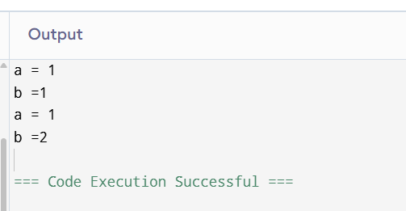
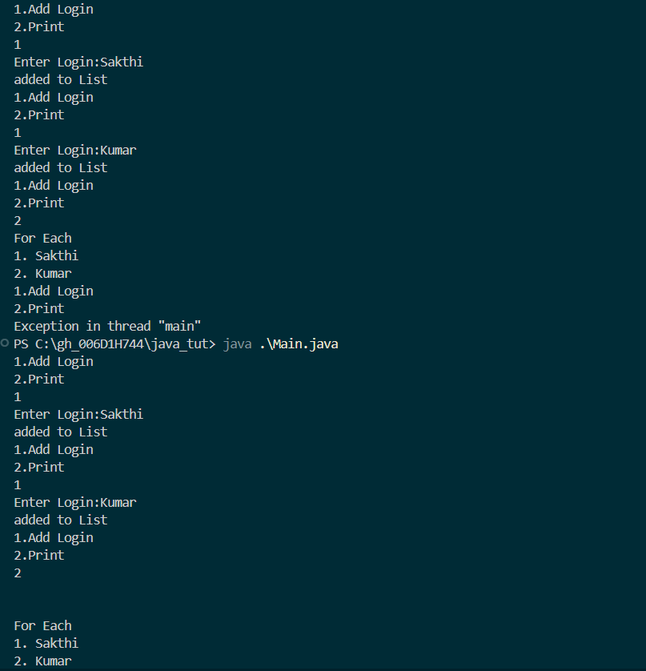

### Task #1:
    What do you understand by Big O notation
    1. Big O notation specifies the worst case complexity of an algorithm.
    2. It can be used to describe either time or space complexities 
    3. it shows us the relationship between growth of the algorithm in terms of time/space
    with respect to the input size.

### Task #2:
    What are arrays, how many types of arrays are there
    1. Arrays are Data structure where the elements of same data type
     are stored in contigious memory location. 
    2. Types of arrays: single dimensional, mulitdimensonal
        It can be stored either in column major or row major
        (i think Java doesnt support either because it only supports array of arrays    )

### Task #3:
    What do you understand by strings in java.


### Task #4:
    Create an array in java.

```java
    
public class ArrayExample{

    public static void main(String[] args){
        int[] numbers = {10,20,30};
        System.out.println(numbers[0]);
    }
}

```


### Task #5:
    Create a Java program to print a string in reverse order

```java
    
public class StringExample{

    public static void main(String[] args){
        String s = "Hello World";
        // here we start with the last char and print one by one till the start
        for(int i=s.length-1;i>=0;i--)  
            System.out.print(s.charAt(i));
        System.out.println();
    }
}

```

### Task #6:

    What is static variable, give example of how its different from regular a non-static variable

```java
class Main{
    public static void main(String[] args){

        Example obj_1 = new Example();
        Example obj_2 = new Example();
        // here we are initializing both the objects of the class Example

        obj_1.init();
        obj_2.init();

        // Here since the var b is shared by both of the objs (obj_1 and obj_2)
        // we will notice the b's value to be 2 when incrementing individual methods
        obj_1.increment();
        obj_1.printVars();
        obj_2.increment();
        obj_2.printVars();
    }
}


class Example{
    int a;
    static int b;
    void init(){
        a = 0;
        b = 0;
    }
    void increment(){
        a = a+1;
        b = b+1;
    }
    void printVars(){
        System.out.println("a = "+a);
        System.out.println("b ="+b);
    }
}

```

    output:
    


### Task #7:
    Write a Java program to print numbers from 100 to 10

    ```java
    
public class LoopExample{

    public static void main(String[] args){

        // here we start with the last number and print one by one till the start
        for(int i=100;i>=0;i--)  
            System.out.print(i+",");
        System.out.println();
    }
}

    ```

### Task #8:
    Write a Program to accept logon id and pwd from the user and display welcome message if the login id is "prasunamba", pwd is"4321", use while loop
```java
import java.util.Scanner;

public class Login{
    public static void main(String[] args){
        Scanner scanner = new Scanner(System.in);
        String login;
        String pswd;
        while(true){
            System.out.print("Enter Login ID:");
            login = scanner.nextLine();
            System.out.print("Enter Password:");
            pswd = scanner.nextLine();
            if(login == "Parasunamba" && pswd=="4321"){
                System.out.println("Welcome "+login+"!");
            }
        }
    }

}
```


### Task #9:

    Write a Program to accept logon id and pwd from the user and display welcome message  use do while loop
```java
import java.util.Scanner;

public class Login{
    public static void main(String[] args){
        Scanner scanner = new Scanner(System.in);
        String login;
        String pswd;
        do{
            System.out.print("Enter Login ID:");
            login = scanner.nextLine();
            System.out.print("Enter Password:");
            pswd = scanner.nextLine();
            System.out.println("Welcome "+login+"!");
            
        }while(true);
    }

}
```

### Task #10:
Wap to display the use of if, else if, nested if:

```java

import java.util.Scanner;

public class Conditional{
    public static void main(String[] args){
        Scanner scan = new Scanner(System.in);
        int a = scan.nextInt();
        if(a%2==0){
            System.out.println("a is even number");
        }
        else{
            System.out.println("a is odd");
        }
        if(a>0){
            System.out.println("a is a natural number");
        }else  if(a<0){
            System.out.println("a is an integer");
        }
        if(a>0){
            if(a%2==0){
                System.out.println("ä is a natural number and an even number");
            }
        }
    }
} 

```


### Task #11:
    wap to display the use of a switch case

```java
import java.util.Scanner;

public class Switch{
    public static void main(String[] args){
        Scanner scan = new Scanner(System.in);
        char a = scans.next().charAt(0);
        switch(a){
            case 'S':{System.out.println("Small");break;}
            case 'M':{System.out.println("Medium");break;}
            case 'L':{System.out.println("Large");break;}
        }
    }
} 


```


### Task 12:
    What are access modifiers in java. give detailed explanation.

    Access modifiers in Java are used to give control the use or restrict the 
    resources(data members, methods) access to certain user group or other classes.
    There are 4 major access modifiers:
    Private: 
        only available to members of the current obj. 
        Arent inherited
    Protected:
        only available to members of the current obj.
        These are inherited as protected members;
    Public:
        Allows access to members where ever object is live(eg: main).
        These are inherited as public.


### Task 13:
    ForEach loop
```java

import java.util.ArrayList;
import java.util.Scanner;

public class Main{
    public static void main(String[] args){
        Scanner scan = new Scanner(System.in);
        ArrayList<String> list = new ArrayList<>();
        while(true){
            System.out.println("1.Add Login\n2.Print");
            char a = scan.nextLine().charAt(0);
            switch(a){
                case '1':{
                    System.out.print("Enter Login:");
                    String s = scan.nextLine();
                    list.add(s);
                    System.out.println("added to List");
                    break;
                }
                case '2':{
                    int i = 1;
                    System.out.println("\n\nFor Each");
                    for(String s:list){
                        System.out.println(""+i+". "+s);
                        i = i+1;
                    }
                }
                
            }

        }
    }
}


```

Output:



