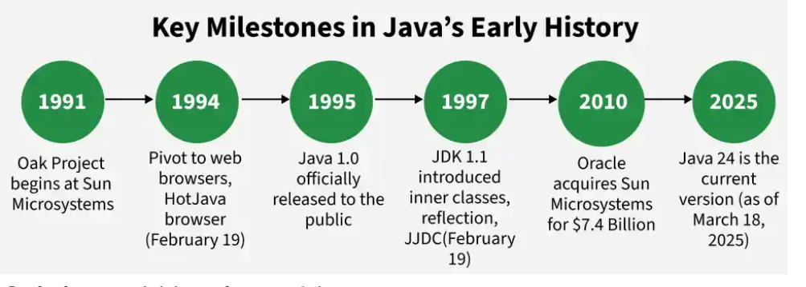
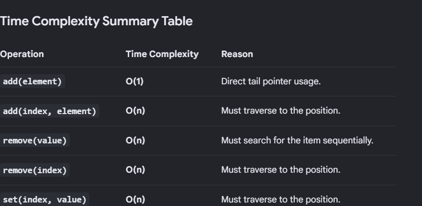

### Task 1
Write a program to demonstrate method overloading

```java
class Display {
    // Accepts an integer
    void printData(int a) { 
        System.out.println("Integer: " + a); 
    }
    // Accepts a String
    void printData(String b) { 
        System.out.println("String: " + b); 
    }
}


class MethodOverloading{
    void add(int a,int b){
        System.out.println(a+b);
    }
    void add(int a,int b,int c){
        System.out.println(a+b+c);
    }
    void add(String a,String b){
        System.out.println(a+b);
    }
}
```

### Task 2
Write a brief history of Java.


Java was originally developed under the Green Project by Sun Microsystems for consumer electronic devices.

Over the years, Java has evolved significantly and become a major technology for enterprise, web, mobile, and cloud-based applications.

Follows the principle of Write Once, Run Anywhere (WORA).
Supports Object-Oriented Programming (OOP) concepts.
Known for platform independence, security, and robustness.

### Task 3

```java
import java.util.LinkedList;

public class LLDemo{
    public static void main(String[] args){
        LinkedList<String> skills = new LinkedList<>();
        skills.add("Java");
        skills.add("C++");
        System.out.println("Initial List: " + skills);
        skills.addFirst("OOPS");
        System.out.println("1 List: " + skills);
        skills.set(1,"DSA");
        System.out.println("2 List: " + skills);

    }

}
```



Custom Linkedlist 
```java

class Main{
    public static void main(String[] args){
        Linkedlist list = new Linkedlist();
        list.add_element_begin(1);
        list.add_element_begin(2);
        list.add_element_begin(2);
        list.add_element_end(88);
        list.print();
    }
}

class Node{
    int data;
    Node next;
    Node(int data){
        this.data = data;
    }
}

class Linkedlist{
    Node head;
    int size;
    Linkedlist(){
        head = null;
        size = 0;
    }
    void add_element_end(int data){
        Node newNode = new Node(data);
        Node cur = head;
        if(cur==null)this.head = newNode;
        else{
            while(cur.next!=null){
                cur = cur.next;
            }
            cur.next = newNode;
        }
    }
    void add_element_begin(int data){
        Node newNode = new Node(data);
        newNode.next = this.head;
        this.head = newNode;
    }
    void print(){
        Node cur = head;
        while(cur!=null){
            System.out.print(cur.data+" ");
            cur= cur.next;
        }
        System.out.println();
    }

}

```

### Task 4
Write a program to showcase swapping of two variable.


```java
public class Main{
    public static void main(String[] args){
        // swap two numbers with temp var
        int a,b;
        int temp;
        b = temp;
        b = a;
        a = temp;


// swap two numbers with xor
        int x,y;
        x = x^y;
        y = x^y;
        x = x^y;

// swap two numbers with arithmetic operations 
        int p,q;
        p = p+q;
        q = p-q;
        p = p-q;
    }

}
```

### Task 5
Write a program which uses stack using dequeue and array dequeue

```java
import java.util.ArrayDeque;
import java.util.Deque;

public class DequeStackExample {
    public static void main(String[] args) {
        // 1. Initialize a Deque as a Stack
        Deque<String> stack = new ArrayDeque<>();

        // 2. Push elements onto the stack (LIFO)
        stack.push("Books");
        stack.push("Laptop");
        stack.push("Coffee");

        System.out.println("Stack after pushes: " + stack); 
        // Output: [Coffee, Laptop, Books]

        // 3. Peek at the top element without removing it
        String topItem = stack.peek();
        System.out.println("Top item (peek): " + topItem); 
        // Output: Coffee

        // 4. Pop elements off the stack
        String poppedItem = stack.pop();
        System.out.println("Popped item: " + poppedItem); 
        // Output: Coffee

        System.out.println("Stack after pop: " + stack); 
        // Output: [Laptop, Books]

        while (!stack.isEmpty()) {
            System.out.println("Popping remaining: " + stack.pop());
        }
    }
}


```


### Task 6

```java
import java.util.LinkedList;
import java.util.Queue;

public class QueueExample {
    public static void main(String[] args) {
        // Instantiate a Queue using a LinkedList implementation
        Queue<String> line = new LinkedList<>();
        line.add("Hello");
        line.add("to");
        line.add("world");
        System.out.println(line);
    }
}


```


### Task 7
```java
public class EncapsulationDemo{

    private String name;

    public String getName(){
        return name;
    }
    pubilc String setName(String name){
        this.name = name;
    }
}
```
This example doesnt let the users of this call to directly modify the variable name, instead it allows the user to modify only through channels or methods 


### Task 8:
write the advantages of polymorphism

1. It increases the usability of particular classes and reusability of methods and gives us more flexibility while 
    inheritance 

### Task 9:
write a program to show encapsulation feature in hava 
```java
public class EncapsulationDemo{

    private String name;

    public String getName(){
        return name;
    }
    pubilc String setName(String name){
        this.name = name;
    }
}
```

### Task 10:
what are the advantages and disadvantages of Encapsulation 

#### Advantages
**AdvantagesData Hiding:** It restricts direct access to internal variables, preventing accidental or unauthorized tampering from external code.
**Easy Maintenance:** You can change internal class logic without breaking external code, keeping software updates smooth and isolated.

#### Disadvantages
**Code Bloat:** It increases line count and verbosity due to the repetitive creation of explicit getter and setter methods.
**Performance Overhead:** Accessing data through method calls instead of direct variables can add minor processing delays in high-speed applications.

### Task 11:
WAP to use the concept of type casting:

```java
class Main{
    public static void main(String[] args){
        Double pi = 3.1415;
        int approxPi = (int)pi;
        System.out.println(approxPi);
    }
}

```

### Task 12:
boxing and auto unboxing

```java
public static void main(String[] args){
    Integer a = new Integer(60);
    // here a is getting automatically unboxed
    // while compiling it become a.value
    int b = a+10;
}

```
boxing and unboxing are the implicit or explicit conversion of primitive data types to and from their respective Wrapper classes


#### Wrapper Class

>there are some wrapper classes for primitive data types and used for some template classes.