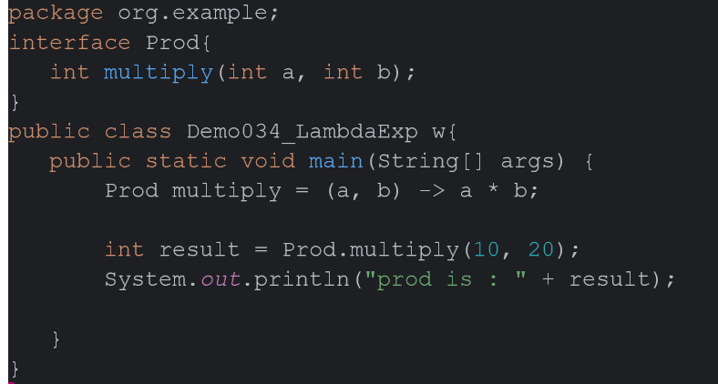
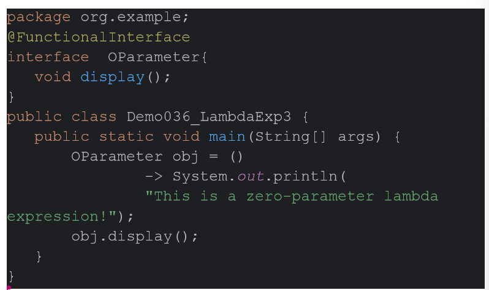
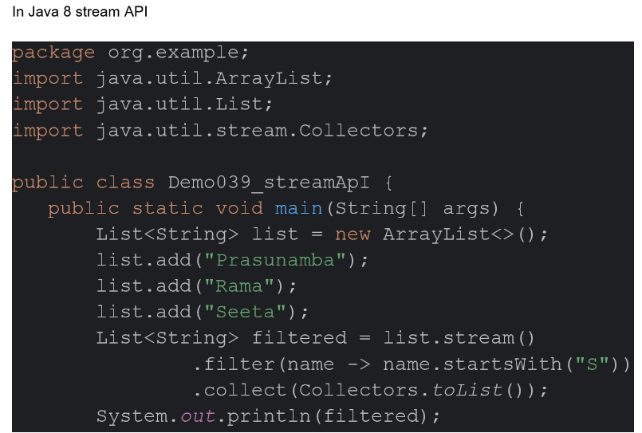
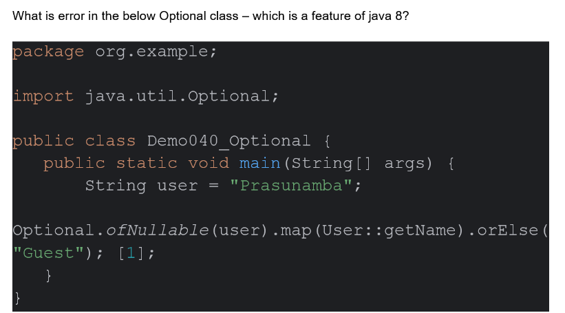

## day 6


### Task 1 
To implement a lambda function to display Hello world 


```java
@FunctionalInterface
interface Hello{
    void hello();
}

public class Main{
    public static void main(String[] args){
        Hello world = () => {
            System.out.println("hello world");
        }
        world.hello();
    }
}
```

### Task 2



1. Pro.multiply wont work because its an abstract method
2. only multiply.multiply is the defined method defined by the lambda function.


### Task 3 
To use as little line as possible to implement a lambda function to do any calc oprtation.

```java

import java.util.function.*;

public class  Main{
   public static void main(String[] args) {
       BiFunction<Integer,Integer,Float> percent= (a, b) -> (float)a / b * 100;
       System.out.println("percent is : " + percent(37,56));

   }
}
```


### Task 4:

You need to create an interface
-> With one abstract method (SAM) and 1 normal method
→ can you create  2 normal methods ?
→ can i have a method with abstract keyword


```java
public class Main{
    public static void main(String[] args) {
        Print obj = (int a ) -> System.out.println(a);
        obj.printNumber(199);

   }
}

@FunctionalInterface
interface Print {

    void printNumber(int a);
    default void  printHelloWorld(){
        System.out.println("Hello world");
    }
    default int  regularMethod(int a ){
        System.out.println(a);
        return a;
    }
}
```

1. This implementation has two defualt methods(regular methods with implementation.)
2. By default every method of an interface is abstract, its optional and we can skip if needed;

### Task 5

What is this code  snippet doing



Can i have a zero parameter labda exp or not? 

>There can be zero parameter lambda exp in Java


### Task 6

Create an ArrayList and use forEach loop and display if they they are even nos or not 

```java
import java.util.ArrayList;
import java.util.Arrays;

class Main{
    public static void main(String[] args){
    ArrayList<Integer> list = new ArrayList<>(Arrays.asList(1, 2, 4, 5, 6, 7, 8, 89, 1, 212, 54));    // list = ;
        list.forEach(ele-> System.out.println(ele+" is "+(ele%2==1?"even":"odd")));
    }
}
```

### Task 6.1 
assert example 
```java
import java.util.Scanner;

class Test{

    public static void main(String[] args){
        int age = 20;
        Scanner scan1 = new Scanner(System.in);
        age = scan1.nextInt();
        assert age>=18:"cannot vote";
        System.out.println("U"+age);
    }

}
```
1. To use assertion while development phase.
2. Can enable and disable assertion whenever needed.
3. Can be used to stop running the code if there is any impossible states
4. To check if the assumption are present.(sanity checks)


### Task 7
What is Junit 5
Junit is a testing framework for the Java programming language that helps developers write and run repeatable automates tests
Ensures code reliablity and quality


### Task 8

List down the annotations of Junit 5

1. BeforeAll, AfterAll
2. BeforeEach, AfterEach
3. Disabled
4. Tag
5. DisplayName


### Task 9
Difference between Junit 5 and Junit 4
1. Junit4 is for java version 5+ and Junit5 is for Java 8+
2. Junit5 is the latest version of the Junit and has a bunch of new features Support for parameterized tests, dynamic tests, 
and a unified extension model. Additionally, JUnit 5 allows for conditional test execution and improved assertions, 
making it more powerful and flexible for modern Java applications

### Task 10
What is JUnit Test suite 
A JUnit test suite is a collection of test classes or test cases grouped together to run as a single unit, 
making it easier to organize, execute, and manage Java tests in projects.

### Task 11
what is JUnit Vintage

JUnit Vintage is a testing engine that allows you to run JUnit 3 and JUnit 4 tests on the JUnit 5 platform.

### Task 12 
what is a mock object
a mock object is an object that imitates a production object in limited ways. A programmer might use a mock object as a test double for software testing

### Task 13
Write about Mockito?
Mockito is an open-source mocking framework for Java that allows developers to create test double objects (mocks) for clean and effective unit testing.

### Task 14
Define Functional Interface a java 8 feature

FunctionalInterface in are SAM(Single Abstract Method) interfaces which means intrfaces with only one abstract method.
There are a lot of FunctionalInterface in Java which helps us write Lambda functions for various usecases.
Some of the FunctionalInterface are :
1. Supplier
2. Function
3. Customer
4. BiFunction
5. Predicate

these various FunctionalInterface are defined from Java 8+


### Task 15
What are default and static methods in interfaces?
>Default Method 

Default methods in interfaces helps use implement a default base implementation
which can be optionally overridden by interfaces implementation.

>static methods:

A static method used to define methods inside interfaces which cannot be overridden
Can be called from using the interface name only.(eg:InterfaceName.staticMethod()) 
The scope of the static method is limited to the interface in which it is defined.

### Task 16

Java 8 Stream API lets you process data as a pipeline: a source, zero or more intermediate operations (like filter and map), and a terminal operation (like count or forEach)




### Task 17

**Optional Class** in Java are used to negate with with null pointer exception.
They have a set of useful methods which help us to deal with objects which can be null 


### Task 18





### Task 19
The double colon (::) operator, also known as method reference operator in Java, is used to call a method by referring to it with the help of its class directly.

### Task 20

What is method Reference in java 8?


Sample Usage from GFG
```java
import java.util.Arrays;
public class Geeks{
    
  	// Method
    public static void print(String s){
        System.out.println(s);
    }

    public static void main(String[] args){
        
        String[] names = {"Geek1", "Geek2", "Geek3"};

        // Using method reference to print each name
        Arrays.stream(names).forEach(Geeks::print);
        //NOTE: this will provide refernce for the print method.
    }
}

```

### Task 21

There are different types of method reference

· Types:
o Static methods (Math::max)
o Instance methods (String::toLowerCase)
o Constructors (ArrayList::new)
Wap to use the above types of methods and show the use of each type


### Task 22

Java 8 one more feature is date and time api

Modern date and time 

localDate(date) ,
localTime(time),
localDateTime(both)
ZoneDateTime(timezone)


Don't use  legacy..
Java.util.Date;
java.util.Calender; 


## Junit 
Unit test cases 


