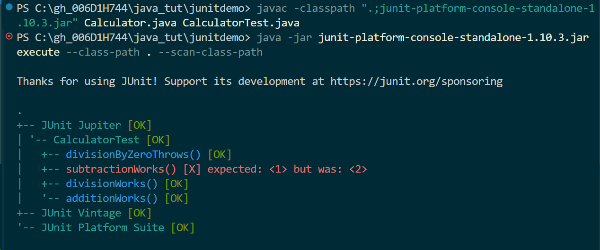
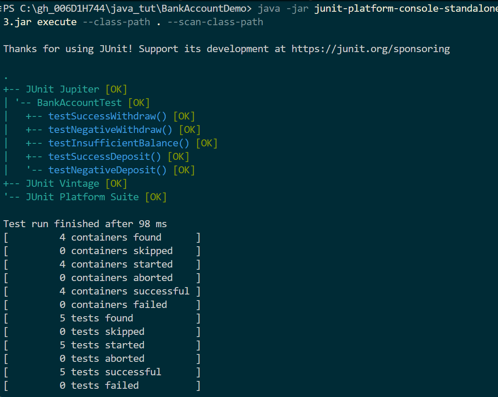
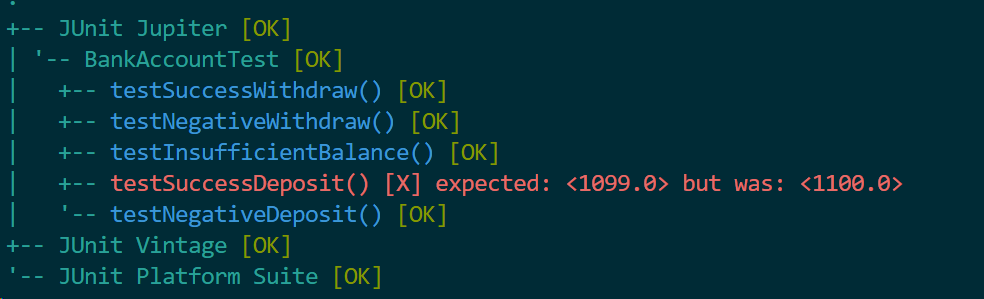

# Day 07

### Task 1 

>Calculator.java

```java
public class Calculator {
    public int add(int a, int b) {
        if (a < 0 || b < 0) {
            throw new IllegalArgumentException("Negative numbers not allowed");

        }
        return a + b;
    }
    
    public int subtract(int a, int b) {
        return a - b;
    }
    
    public int multiply(int a, int b) {
        return a * b;
    }
    
    public double divide(int a, int b) {
        if (b == 0) {
            throw new ArithmeticException("Cannot divide by zero");
        }
        return (double) a / b;
    }

}
```

> CalculatorTest.java
```java
import org.junit.jupiter.api.Test;
import org.junit.jupiter.api.BeforeEach;
import static org.junit.jupiter.api.Assertions.*;

public class CalculatorTest {

    private Calculator calc;

    
    @BeforeEach
    void setUp() {
        calc = new Calculator();
    }
    
    @Test
    void additionWorks() {
        assertEquals(5, calc.add(2, 3));
    }
    
    @Test

    void subtractionWorks() {
        assertEquals(1, calc.subtract(5, 3));
    }
    
    @Test
    void divisionWorks() {

        assertEquals(2.5, calc.divide(5, 2));
    }
    
    @Test
    void divisionByZeroThrows() {
        assertThrows(ArithmeticException.class, () -> {
            calc.divide(5, 0);
        });
    }
}
```
Output:



we need to run the following command to use execute in JUnit and run with a jar file

```bash
javac -cp ".;junit-platform-console-standalone-1.10.3.jar" Calculator.java CalculatorTest.java
java -jar junit-platform-console-standalone-1.10.3.jar execute --class-path . --scan-class-path
```


### Task 2

```java
class BankAccount{
 
    String accountNumber;
    double balance;

    BankAccount(String accountNumber,double balance){
        this.accountNumber = accountNumber;
        this.balance = balance;
    }

    double deposit(double amount){
        if(amount<0){
            throw new IllegalArgumentException("Negative numbers not allowed");
        }
        this.balance = this.balance+amount;
        return this.balance;
    }

    double withdraw(double amount){
        if(amount<0){
            throw new IllegalArgumentException("Negative numbers not allowed");
        }
        if(amount<balance){
            throw new IllegalArgumentException("Insufficient balance");
        }
        return this.balance;
    }
}
```


```java

import org.junit.jupiter.api.Test;
import org.junit.jupiter.api.BeforeEach;
import static org.junit.jupiter.api.Assertions.*;
public class BankAccountTest{
    private BankAccount account;
    @BeforeEach
    void setup(){
        account = new BankAccount("87612371236",1000.0);
    }

    @Test
    void testNegativeDeposit(){
        assertThrows(IllegalArgumentException.class, ()->{account.deposit(-100.0);});
    }

    @Test
    void testNegativeWithdraw(){
        assertThrows(IllegalArgumentException.class, ()->{account.withdraw(-100.0);});
    }

    @Test
    void testSuccessDeposit(){
        assertEquals(1100.0,account.deposit(100.0));
    }

    @Test
    void testSuccessWithdraw(){
        assertEquals(900.0,account.withdraw(100.0));
    }

    @Test 
    void testInsufficientBalance(){
      Exception ex = assertThrows(IllegalArgumentException.class, () -> {
               account.withdraw(200.0);
           });
       assertEquals("Insufficient balance", ex.getMessage());
   }
}

```

Output:





### Task 3
for the about test case create a failed test case 




### Task 4

```java

import org.junit.jupiter.api.Test;
import org.junit.jupiter.params.ParameterizedTest;
import org.junit.jupiter.params.provider.ValueSource;


import static org.junit.jupiter.api.Assertions.assertFalse;
import static org.junit.jupiter.api.Assertions.assertTrue;


class StringUtils{
    // randome palindrom code from internet
     static boolean isPalindrome(String s){

        s = s.toLowerCase();
        int i = 0, j = s.length() - 1;

        while (i < j) {

            if (s.charAt(i) != s.charAt(j)) {
                return false;
            }
            i++;
            j--;
        }
        return true;
    }
}


public class Parameterized_Test {


   @ParameterizedTest
   @ValueSource(strings = {"amma", "mom", "nitin"})
   void testPalindromePass(String candidate) {
       assertTrue(StringUtils.isPalindrome(candidate));
   }
   //fail
   @Test
   void testPalindromeFail() {
       // "hello" is NOT a palindrome, so this will fail
       assertTrue(StringUtils.isPalindrome("hello"), "Expected true but got false");

   }


   @ParameterizedTest
   @ValueSource(strings = {"java", "spring", "bank"})
   void testNotPalindrome(String candidate) {
       assertFalse(StringUtils.isPalindrome(candidate));
   }
}


```
output: 


### Task 5
What is Junit Life cycle hook (set up tear down) ?
> In JUnit, lifecycle hooks are methods that allow you to execute code at specific points during the test execution process. The primary annotations for these hooks are @BeforeAll, @BeforeEach, @AfterEach, and @AfterAll, which manage setup and cleanup tasks for your tests.
1. BeforeAll: to run it once before all of the tests ie **Setup**
2. BeforeEach: to run it one beofre each of the test.
3. AfterAll: to run it after all the tests. ie .***tear down***
4. AfterEach: to run it after each test.


### Task 6


```java

import org.junit.jupiter.api.*;
import static org.junit.jupiter.api.Assertions.*;


public class Demo04_LifeCycleHooks_Setup_TearDown {
   private Demo04_DatabaseService db;


   @BeforeEach
   void init() {
       db = new Demo04_DatabaseService();
       db.connect();

   }


   @AfterEach
   void cleanup() {
       db.disconnect();
   }


   @Test
   void testInsertAndFetchPass() {
       db.insert("user1", "Prasunamba");
       assertEquals("Prasunamba", db.fetch("user1"));
   }


   //fails
   @Test
   void testInsertAndFetchFailValue() {
       db.insert("user1", "Prasunamba");
       // This will fail because actual = "Prasunamba", expected = "WrongName"
       assertEquals("WrongName", db.fetch("user1"), "Expected WrongName but got " + db.fetch("user1"));
   }


   //fails
   @Test
   void testFetchNonExistentKeyFail() {
       // No insert performed, so fetch returns null
       assertEquals("SomeValue", db.fetch("missingKey"), "Expected SomeValue but got null");
   }
}


```


### Task 7
Assertions are static utility methods used to validate that the actual execution of your code matches your expected outcomes
they can be used to check behevior of the code ( be it the returned value or the exceptoin trown, etc)


### Task 8
JUnit provides a handy option of Timeout. If a test case takes more time than the specified number of milliseconds, then JUnit will automatically mark it as failed. The timeout parameter is used along with @Test annotation.
