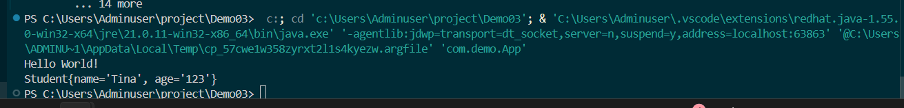
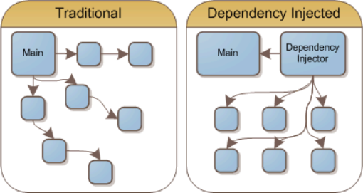
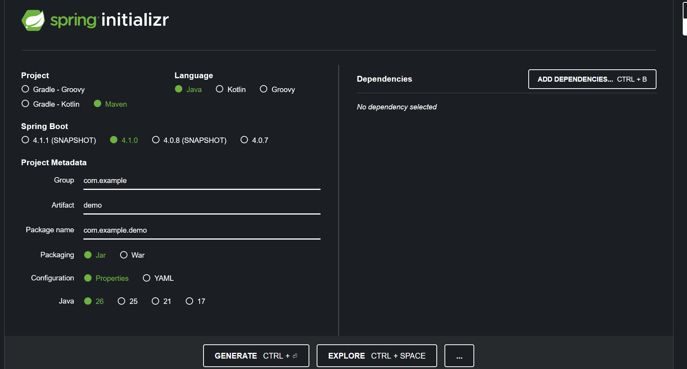
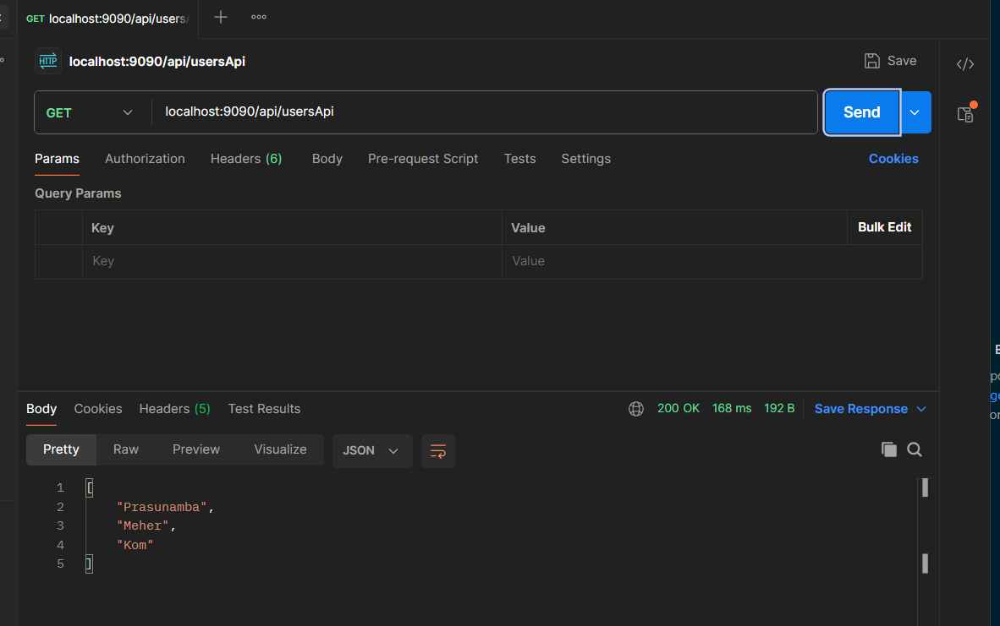
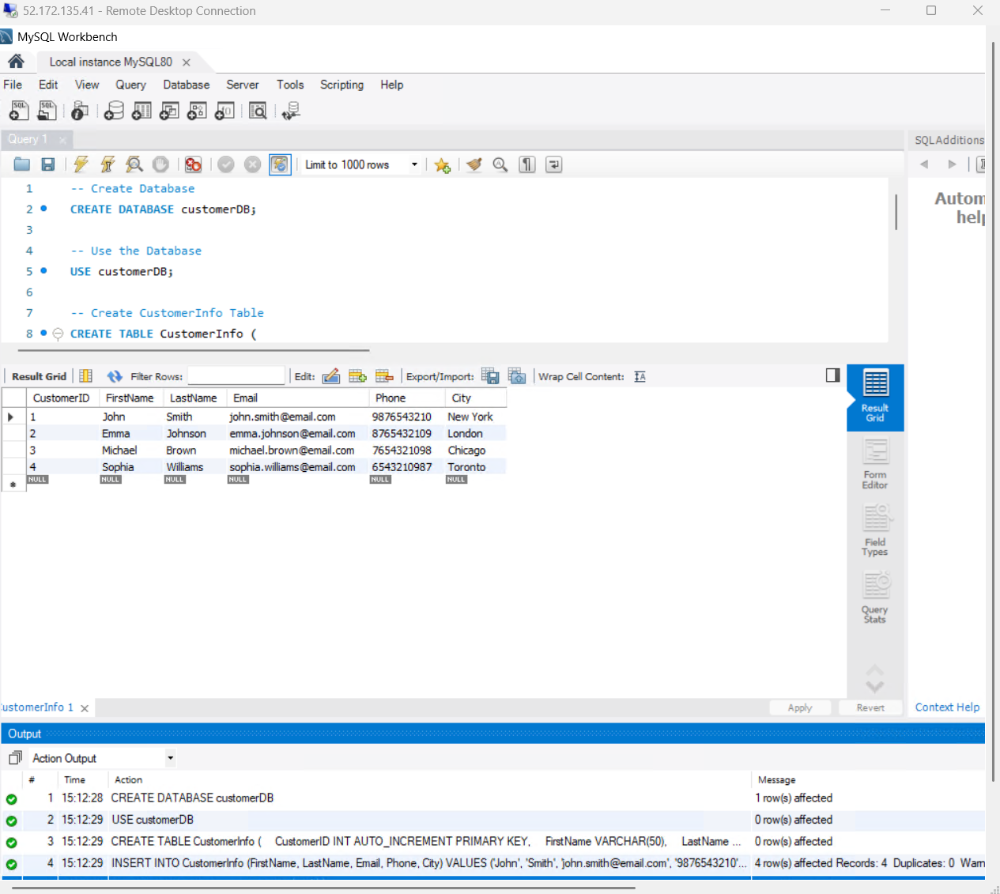
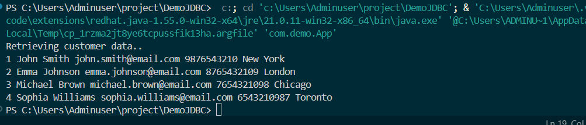

## Day 9


### Task 1 
[New Project](./source_code/Spring_Framework/Demo03)
Maven Quick Start

### Task 2
[POJO file](source_code\Spring_Framework\Demo03\src\main\java\com\demo\Student.java)
```java
package com.demo;

import org.springframework.beans.factory.annotation.Autowired;

public class Student {
    String name;
    
   
    String id;

     public Student(String name, String age) {
    this.name = name;
    this.id = age;
  }

  // Method inside POJO class
  @Override
  public String toString() {

    // Print student class attributes
    return "Student{" + "name='" + name + '\'' + ", age='" + id + '\'' + '}';
  }

}

```
### Task 3

[Bean-factory-demo.xml](./source_code/Spring_Framework/Demo03/src/main/resources/bean-factory-demo.xml)

```xml
<?xml version="1.0" encoding="UTF-8"?>

<beans xmlns="http://www.springframework.org/schema/beans"
       xmlns:xsi="http://www.w3.org/2001/XMLSchema-instance"
       xsi:schemaLocation="
           http://www.springframework.org/schema/beans
           https://www.springframework.org/schema/beans/spring-beans.xsd">

    <bean id="student" class="com.demo.Student">
        <constructor-arg name="name" value="Tina"/>
        <constructor-arg name="id" value="123"/>
    </bean>

</beans>
```



### Task 4
Can you explain application context with the syntax..

ApplicationContext is an advanced interface in the Spring Framework that acts as a powerful IoC container for managing beans and their lifecycle. It extends BeanFactory and provides additional enterprise-level features like event handling, internationalization, and annotation-based configuration. 
```java
Student student = context.getBean(Student.class);
```


### Task 5 
Why use application context .. plz list some uses?
n the Spring Framework (Java)In Spring, the ApplicationContext is the central Inversion of Control (IoC) container. It manages object lifecycles, configuration, and dependencies.

***How it is used in Development:***
1. *Dependency Injection:* Automatically links components together during local testing.
2. Profile Switching: Allows developers to load dummy data or mock beans using a @Profile("dev") configuration.
3. Hot Swapping: Works alongside developer tools to reload configuration changes on the fly without restarting the entire system.

***How it is used in Production:***
1. *Resource Management:* Eagerly initializes singleton components at startup to ensure high runtime performance and immediate availability for users.
2. *Enterprise Services:* Handles active database connection pooling, transaction management, and security.
3. Internationalization (i18n):
   
### Task 6
What are features of Spring Framework .. list them with 1 or 2 lines explanation?

1. Core FeaturesInversion of Control (IoC): Delegates the creation and management of application objects to the Spring container.
2. Dependency Injection (DI): Automatically injects required dependencies into objects, eliminating hardcoded relationships.
3. Aspect-Oriented Programming (AOP): Separates cross-cutting concerns like logging and security from core business logic.
4. Spring Expression Language (SpEL): Provides a powerful expression language to query and manipulate an object graph at runtime.

### Task 7
Why do you think we use spring framework.. Advantages list them down?

1. No Boilerplate Code: It eliminates repetitive coding tasks like opening database connections or managing transactions manually   
2. Massive Ecosystem: Developers get instant integration with cloud services, microservices, batch processing, and big data systems.
3. Huge Community Support: A mature, globally backed community ensures rapid bug fixes, extensive documentation, and endless learning resources.
4. Component dependencies are managed externally via Dependency Injection
   
### Task 8
What do you understand by IOC? Explain with diagram.. 

>Inversion of Control (IoC) is a design principle where the control of object creation, configuration, and lifecycle is transferred from the program code to an external framework or container.Instead of your code creating objects manually using the new keyword, the framework creates and manages them for you.



### Task 9
How many types of IOC do you have in spring?
What are they with explanation

1. BeanFactory
   1. The most basic and lightweight IoC container.
   2. It uses lazy initialization, meaning it creates and configures beans only when you explicitly ask for them using `getBean()`;
2. ApplicationContext
   1. An advanced, feature-rich container that builds on top of BeanFactory.
   2. It uses eager initialization by default (loading all singletons at startup) and includes all BeanFactory features plus enterprise-ready additions.
   
### Task 10 
What is DI in spring?

In the Spring Framework, Dependency Injection (DI) is a core design pattern used to pass required objects (dependencies) directly into a class from an external source, rather than forcing the class to create them manually.
DI serves as a practical implementation of Inversion of Control (IoC). Instead of your application code controlling object creation with the new keyword, control is handed over to the Spring IoC Container, which builds and supplies those objects automatically.

### Task 11
How many types of DI do we have?
1. Constructor Injection: Passing dependencies through the class constructor.
2. Setter Injection: Passing dependencies through standard setter (setX()) methods.
3. Field Injection: Injecting dependencies directly into private variables using annotations like `@Autowired.`

### Task 12
What is Spring Application Configuration?

Spring Application Configuration is the mechanism used to define, organize, and wire your application's components (Beans) and settings so the Spring IoC Container knows how to instantiate and manage them.It acts as the blueprint or "instruction manual" for your entire Spring application.


### Task 13
What are the different ways to configure spring applications?

1. Java-Based Configuration (Modern Standard)
```java
@Configuration
public class AppConfig {
    @Bean
    public Engine v8Engine() {
        return new V8Engine();
    }
}
```
2. Annotation-Based Configuration (Component Scanning)
   * Instead of explicitly declaring every single bean, you place stereotype annotations like `@Component`, `@Service`, `@Repository`, or `@RestController` directly on your classes. Spring scans your project packages and registers them automatically.
```java
@Service
public class CarService {
    // Spring discovers and configures this automatically
}
```
3. XML-Based Configuration (Legacy)
 * Components and their dependencies are defined inside an external XML file (usually named applicationContext.xml).  
```xml
    <bean id="student" class="com.demo.Student">
        <constructor-arg name="name" value="Tina"/>
          <constructor-arg name="id" value="123"/>
    </bean>
```

### Task 14 
Why we need spring application copnfiguration?

We need Spring Application Configuration because it decouples object creation from application logic, centralizes environment settings, and automates component management.Without configuration, your application becomes tightly coupled, rigid, and incredibly difficult to test.


### Task 16
1. **Singleton Scope**: (Default) Only one single instance of the bean is created per Spring IoC container. Every time that bean is requested or injected into another class, Spring returns the exact same shared instance.

2. **Prototype Scope**: A brand new instance of the bean is created every single time it is requested or injected. Spring instantiates the bean, hands it over to you, and stops managing its lifecycle (destruction hooks are not called automatically).

### Task 17
Autowiring in Spring is a feature that allows the Spring framework to automatically inject dependencies into a class, reducing the need for manual configuration. It simplifies the management of dependencies by automatically resolving and injecting the required beans at runtime.

### Task 18
What are diff ways of autowiring?

There are several ways to autowire in Spring, including byName, byType, and constructor. Each method allows Spring to automatically inject dependencies based on the property name, property type, or constructor arguments, respectively.

### Task 19 
A normal Java object, often referred to as a POJO (Plain Old Java Object), is a simple Java class that does not follow any specific conventions or frameworks. In contrast, a Spring bean is a Java object that is managed by the Spring IoC (Inversion of Control) container, which means it is created, configured, and injected with dependencies automatically by the Spring framework

### Task 20 
`@Component` is a class-level annotation that lets Spring automatically detect and create a bean through component scanning. `@Bean` is a method-level annotation used in a `@Configuration` class to explicitly create and register a bean. Use `@Component` for your own classes, and` @Bean` for third-party classes or when you need custom object creation.

### Task 21 
start.spring.io (Spring Initializr) is not limited to one type of application. It generates the initial project structure for many kinds of Spring Boot applications. The type of application depends on the dependencies you select.
Some Dependencies: 
* Spring Web
* Spring Data JDBC
* Spring Web Services
* Spring Reactive Web (WebFlux)
* Spring GraphQL
* Spring Data JPA


### Task 22
Using Spring initialiser create  an employee class , appcofig file, and main class and see how it works



### Task 23
**@Bean** – Creates a Spring bean manually inside a configuration class.

**@Controller** – Marks a class as a web controller that handles HTTP requests.

**@Value** – Injects values from properties files or environment variables.

**@ComponentScan** – Tells Spring where to find components and beans.

**@Configuration** – Defines a class that contains Spring configuration and bean definitions.

**@Service** – Marks a class as a service layer containing business logic.

**@Repository** – Marks a class as a database access layer component.

**@Qualifier** – Specifies which bean to inject when multiple beans of the same type exist.

**@Required** – Marks a property as mandatory for bean configuration (deprecated).

**@Component** – Marks a class as a Spring-managed component.

**@Autowired** – Automatically injects dependencies into a class.

**@Scope** – Defines the lifecycle of a Spring bean.

### Task 24

What are the features of springboot?

1. Spring Boot is built on top of the Spring Framework, extending its features with auto-configuration and simplified setup.
2. It uses Spring’s core features like dependency injection, MVC, and data access while reducing boilerplate configuration.
3. It offers embedded servers like Tomcat, Jetty, and Undertow to create standalone applications.
4. It provides starter dependencies, Actuator, and externalized configuration for easier development and monitoring.
5. Spring Boot supports microservices, database integration, and fast deployment with minimal code.

### Task 25 
1. Spring Boot reduces development time by providing auto-configuration, starter dependencies, and minimal setup.
2. It simplifies deployment with embedded servers and supports the creation of standalone applications.
3. It improves productivity with production-ready features, easy testing, and strong support for microservices.
   
### Task 26 
What are the key components of Spring boot?

The key components of **Spring Boot** are:

1. **Spring Boot Starter Dependencies** – Pre-configured dependency packages that simplify adding required libraries.
2. **Auto-Configuration** – Automatically configures the application based on the dependencies available.
3. **Spring Boot CLI** – A command-line tool used to quickly develop and run Spring applications.
4. **Spring Boot Actuator** – Provides monitoring and management features like health checks and metrics.
5. **Embedded Servers** – Includes servers like Tomcat, Jetty, and Undertow for running applications independently.
6. **Spring Boot Initializer** – A tool to quickly create and set up Spring Boot projects.


### Task 27
Why spring boot over spring?

1. Less configuration – Spring Boot reduces XML and manual configuration using auto-configuration and annotations.
2. Faster development – Provides starter dependencies and ready-to-use features, reducing development time.
3. Embedded servers – Allows applications to run independently with built-in servers like Tomcat, without external deployment.
4. Production-ready features – Provides Actuator for monitoring, health checks, and application management.
5. Better for microservices – Simplifies building and deploying modern cloud-based microservices applications.

###  Task 28
Spring boot internal working 

In simple flow:

main() → SpringApplication.run() → ApplicationContext creation → Component Scanning → Auto Configuration → Bean Creation → Embedded Server Start → Application Ready

### Task 29
List out the starter dependencies for spring boot

1. spring-boot-starter-web – Used for building web applications and RESTful APIs using Spring MVC and embedded Tomcat.
2. spring-boot-starter-data-jpa – Provides support for database operations using JPA, Hibernate, and Spring Data.
3. spring-boot-starter-jdbc – Provides JDBC support for connecting and working with relational databases.

### Task 30 

```java
import org.springframework.boot.SpringApplication; 
import org.springframework.boot.autoconfigure.SpringBootApplication;
@SpringBootApplication
public class MyApplication 
{ 
  public static void main(String[] args) {
    SpringApplication.run(MyApplication.class, args);
  }
}
```
In this above code ..
What is the internal working of above code .. 
Give thhe step by step explanation 

It will start embedded tomcat server, where the spring boot application will be working with the tomcat server and 
will be ready to handle requests.

### Task 31
What is the syntax to change the port of the embedded Tomcat server in Spring Boot?

```bash
mvn clean package
java -jar .\target\DemoSpringBoot-0.0.1-SNAPSHOT.jar --server.port=9090
```
or 
```bash
mvn spring-boot:run -Dspring-boot.run.arguments="--server.port=8081"
```
this will directly give arguments 


or we can add it to `application.properties` in `main/resources`


## Springboot


```java
@SpringBootApplication
public class Myapp{
    
    public static void main(String[] args){
        
        // here Tomcat which is embedded in spring boot runs automatically
        SpringApplication.run(Myapp.class, args); 
    }
}

@RestController
@RequestMapping("/api/usersApi")
public class MyController{
    
    private List<String> users = List.of("Prasunamba", "Meher", "Kom");

    @GetMapping
    public List<String> getUsers(){
        
        // this is returning JSON response
        return users; 
    }
}

```

1. Get request to `/api/usersApi` will rturn users(list of `String`)




```bash
mvn clean package
java -jar .\target\DemoSpringBoot-0.0.1-SNAPSHOT.jar --server.port=9090
```

or 


```bash
mvn spring-boot:run -Dspring-boot.run.arguments="--server.port=8081"
```


### Spring boot 2 


[Java jdbc with spring and mysql connector](source_code/Spring_Framework/DemoJDBC)


**CustomerDAO.java**
```java
import java.sql.*;

public class CustomerDAO {

    private String driver;
    private String url;
    private String userName;
    private String password;

    // Setter methods for dependency injection
    public void setDriver(String driver) {
        this.driver = driver;
    }
    public void setUrl(String url) {
        this.url = url;
    }
    public void setUserName(String userName) {
        this.userName = userName;
    }
    public void setPassword(String password) {
        this.password = password;
    }

    // fetch customer records
    public void selectAllRows() throws ClassNotFoundException, SQLException {
        System.out.println("Retrieving customer data..");

        // driver is loading
        Class.forName(driver);

        // connection establishment is done here
        Connection con = DriverManager.getConnection(url, userName, password);

        // Executing our query
        Statement stmt = con.createStatement();
        ResultSet rs = stmt.executeQuery("SELECT * FROM CustomerDb.CustomerInfo");

        while (rs.next()) {
            int customerId = rs.getInt(1);
            String customerName = rs.getString(2);
            double customerFees = rs.getDouble(3);
            String custAddress = rs.getString(4);

            System.out.println(customerId + " " + customerName + " " + customerFees + " " + custAddress );
        }

        // Close connection
        con.close();
    }
}

```
**beans.xml**
```xml
<?xml version="1.0" encoding="UTF-8"?>
<beans xmlns="http://www.springframework.org/schema/beans/"
       xmlns:xsi="https://www.w3.org/2001/XMLSchema-instance"
       xsi:schemaLocation="http://www.springframework.org/schema/beans/
        https://www.springframework.org/schema/beans/spring-beans.xsd">

    <bean id="customerDAO" class="CustomerDAO">
        <property name="driver" value="com.mysql.cj.jdbc.Driver"/>
        <property name="url" value="jdbc:mysql://localhost:3306/cusytomerdb"/>
        <property name="userName" value="root"/>
        <property name="password" value="pwd"/>
    </bean>
</beans>

```

```java
public class Main {
    public static void main(String[] args) throws SQLException, ClassNotFoundException {
        
        ApplicationContext context = new ClassPathXmlApplicationContext("beans.xml");

        // Retrieve bean
        CustomerDAO customerDAO = context.getBean("customerDAO", CustomerDAO.class);

        // Call method to fetch cust records
        customerDAO.selectAllRows();
    }
}

```




### Jenkins
1. we can create CI/CD pipeline.
   

