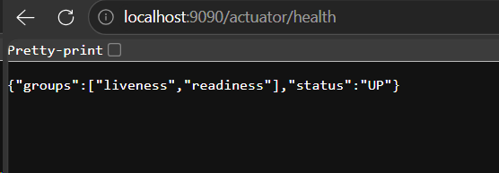
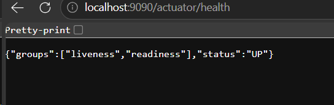
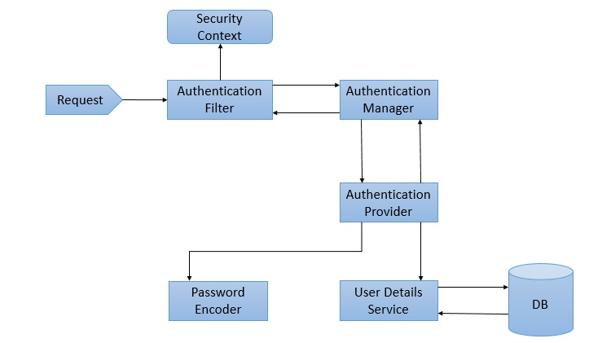
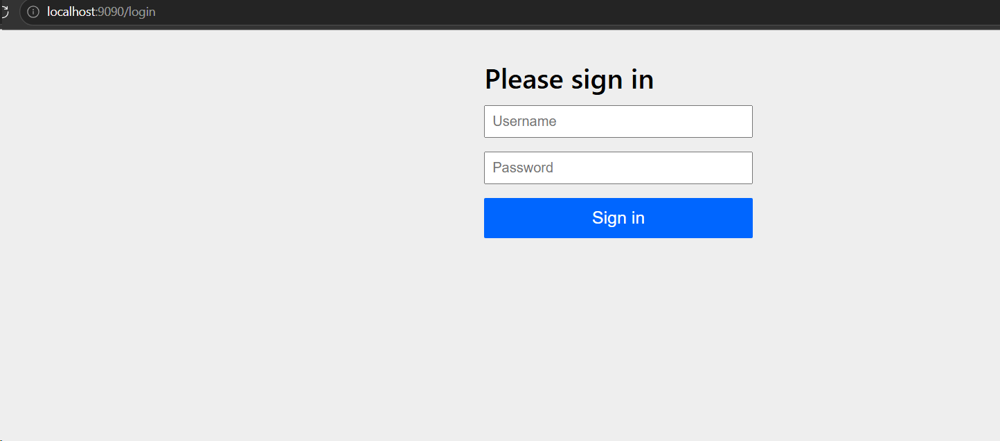
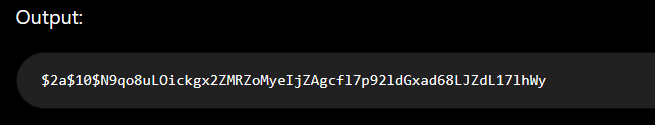

### Task 1: What is an Actuator in Spring Boot?

Spring Boot Actuator is a module that provides built-in endpoints to monitor and manage a Spring Boot application.
It helps developers check application health, metrics, environment details, and other runtime information.

### Task 2: Advantages of Actuator

Spring Boot Actuator simplifies application monitoring by exposing useful management and diagnostic endpoints.
It helps improve application maintenance, performance monitoring, and troubleshooting in production environments.

### Task 3: What are the commonly used Actuator endpoints?

Commonly used Actuator endpoints include `/actuator/health`, `/actuator/info`, `/actuator/metrics`, `/actuator/env`, `/actuator/beans`, and `/actuator/loggers`.
These endpoints provide information about application health, configuration, metrics, Spring beans, and logging levels.


### Task 4: Create a Small demo of Actuator to know the functionality 

```java
    <dependency>
        <groupId>org.springframework.boot</groupId>
        <artifactId>spring-boot-starter-actuator</artifactId>
    </dependency>
```
```properties
management.endpoints.web.base-path=/details
```






### Task 5: What is Spring Security Architecture?

Spring Security Architecture is a framework that secures Spring applications by handling authentication, authorization, and protection against common security threats.
It uses a chain of security filters, authentication providers, and security contexts to verify users and control access to application resources.

### Task 6: What are the core components of Spring security architecture

The core components of Spring Security Architecture include 
1. Security Filter Chain
2. Authentication Manager
3. Authentication Provider
4. UserDetailsService
5. Security Context
6. Password Encoder
These components work together to authenticate users, authorize access, securely manage user information, and protect application resources.

### Task 7:Can you create a diagrammatic representation of Spring Security architecture



### Task 8: What is a Security filter chain? Give example code

The Security Filter Chain is the core component of Spring Security that intercepts every HTTP request before it reaches the application.
It applies security rules such as authentication, authorization, CSRF protection, session management, and request filtering in a specific order.

#### Exammple code:
```java
import org.springframework.context.annotation.Bean;
import org.springframework.context.annotation.Configuration;
import org.springframework.security.config.annotation.web.builders.HttpSecurity;
import org.springframework.security.web.SecurityFilterChain;

@Configuration
public class SecurityConfig {

    @Bean
    public SecurityFilterChain securityFilterChain(HttpSecurity http) throws Exception {

        http
            .authorizeHttpRequests(auth -> auth  
                .requestMatchers("/public/**").permitAll()  // this mathces /public/** and gives permitAll to urls matching this pattern
                .anyRequest().authenticated()
            )
            .formLogin(form -> form.permitAll())
            .logout(logout -> logout.permitAll());

        return http.build();
    }
}
```

Spring Security's filter chain checks every incoming request and enforces these rules before the request reaches your controllers.


### Task 9: What is an Authentication Manager? Give example code

The AuthenticationManager is a core Spring Security component responsible for authenticating users.
It receives an authentication request (such as a username and password), delegates it to an appropriate AuthenticationProvider, and returns an authenticated user if the credentials are valid.

```java
import org.springframework.beans.factory.annotation.Autowired;
import org.springframework.security.authentication.AuthenticationManager;
import org.springframework.security.authentication.UsernamePasswordAuthenticationToken;
import org.springframework.security.core.Authentication;
import org.springframework.web.bind.annotation.*;

@RestController
@RequestMapping("/auth")
public class AuthController {

    @Autowired
    private AuthenticationManager authenticationManager;

    @PostMapping("/login")
    public String login(@RequestParam String username,
                        @RequestParam String password) {

        Authentication authentication =
                authenticationManager.authenticate(
                        new UsernamePasswordAuthenticationToken(username, password));

        return authentication.isAuthenticated()
                ? "Login Successful"
                : "Login Failed";
    }
}
```





### Task 10: What are Authentication Proividers? Give example and code

An AuthenticationProvider is a Spring Security component responsible for verifying user credentials.
It receives an authentication request from the AuthenticationManager, validates the credentials (using a database, LDAP, JWT, etc.), and returns an authenticated user if the credentials are valid.

```java
import org.springframework.context.annotation.Bean;
import org.springframework.context.annotation.Configuration;
import org.springframework.security.authentication.AuthenticationProvider;
import org.springframework.security.authentication.dao.DaoAuthenticationProvider;
import org.springframework.security.core.userdetails.UserDetailsService;
import org.springframework.security.crypto.bcrypt.BCryptPasswordEncoder;
import org.springframework.security.crypto.password.PasswordEncoder;

@Configuration
public class SecurityConfig {

    @Bean
    public AuthenticationProvider authenticationProvider(
            UserDetailsService userDetailsService,
            PasswordEncoder passwordEncoder) {

        DaoAuthenticationProvider provider = new DaoAuthenticationProvider();
        provider.setUserDetailsService(userDetailsService);
        provider.setPasswordEncoder(passwordEncoder);

        return provider;
    }

    @Bean
    public PasswordEncoder passwordEncoder() {
        return new BCryptPasswordEncoder();
    }
}
```


```java
import org.springframework.context.annotation.Bean;
import org.springframework.context.annotation.Configuration;
import org.springframework.security.core.userdetails.*;

@Configuration
public class UserConfig {

    @Bean
    public UserDetailsService userDetailsService() {

        UserDetails user = User.builder()
                .username("admin")
                .password("$2a$10$7EqJtq98hPqEX7fNZaFWoOHiGQKJ6Gm7v8mV6vQk0u6Q4xN2YxQwK") // "password"
                .roles("ADMIN")
                .build();

        return new InMemoryUserDetailsManager(user);
    }
}
```

###  Task 11: What is `UserDetailsService`?

`UserDetailsService` is a core Spring Security interface used to load user-specific information during authentication.
It retrieves user details such as username, password, and roles/authorities from a data source like a database, LDAP, or an in-memory store.

AuthenticationProvider uses `UserDetailsService` to get the user information and verify the provided credentials.

### Task 12: What is Password Encoder?

PasswordEncoder is a Spring Security interface used to securely encode (hash) user passwords before storing them in a database.
It also compares a user's entered password with the stored encrypted password during authentication.

Passwords are not stored as plain text because storing plain passwords creates a security risk. Spring Security commonly uses hashing algorithms like BCrypt to protect passwords.

```java
import org.springframework.context.annotation.Bean;
import org.springframework.context.annotation.Configuration;
import org.springframework.security.crypto.password.PasswordEncoder;
import org.springframework.security.crypto.bcrypt.BCryptPasswordEncoder;

@Configuration
public class SecurityConfig {

    @Bean
    public PasswordEncoder passwordEncoder() {
        return new BCryptPasswordEncoder();
    }
}
```

```java
import org.springframework.security.crypto.password.PasswordEncoder;
import org.springframework.stereotype.Service;

@Service
public class UserService {

    private final PasswordEncoder passwordEncoder;

    public UserService(PasswordEncoder passwordEncoder) {
        this.passwordEncoder = passwordEncoder;
    }

    public void createUser() {

        String rawPassword = "password123";

        String encryptedPassword =
                passwordEncoder.encode(rawPassword);

        System.out.println(encryptedPassword);
    }
}
```




### Task 13: What is SecurityContextHolder?

SecurityContextHolder is a core component of Spring Security that stores and provides access to the current user's security information during a request.
It holds the SecurityContext, which contains the authenticated user's details (Authentication object).

### Task 14: 

```flowchart
Client (Browser / UI / API)
          |
          ▼
Spring Security Filter Chain
          |
          ▼
Authentication Filter
          |
          ▼
Authentication Manager
          |
          ▼
Authentication Provider

          |
          ▼
UserDetailsService
          |
          ▼
Database / LDAP / External System
          |
          ▼
Password Encoder (Password Verification)
          |
          ▼
SecurityContextHolder
          |
          ▼

Controller / Business Logic

```

```flowchart
                 Client Request
                       |
                       ▼
             Security Filter Chain
                       |
                       ▼
            Authorization Filter
                       |
        Is Authentication Required?
                       |
              Yes              No
               |                |
               ▼                ▼
    Authentication Filter     Allow
               |
               ▼
 UsernamePasswordAuthenticationToken
               |
               ▼
      AuthenticationManager
               |
               ▼
      AuthenticationProvider
               |
               ▼
       UserDetailsService
               |
               ▼
          Database
               |
               ▼
       PasswordEncoder
               |
               ▼
       Authentication Object
               |
               ▼
     SecurityContextHolder
               |
               ▼
        Controller Access
```


### Task 15: What is Thymeleaf? Explain? Why is it used?

Thymeleaf is a server-side Java template engine used in Spring Boot applications to create dynamic web pages.
It allows developers to combine HTML with backend data and display dynamic content generated by the server.

Why is Thymeleaf used?

Thymeleaf is used to build user interfaces by connecting HTML pages with Spring MVC controllers and model data.
It provides features like form handling, data binding, conditional rendering, and integration with Spring Security for displaying user-specific content.

### Task 16: 
