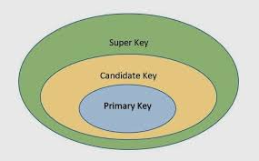
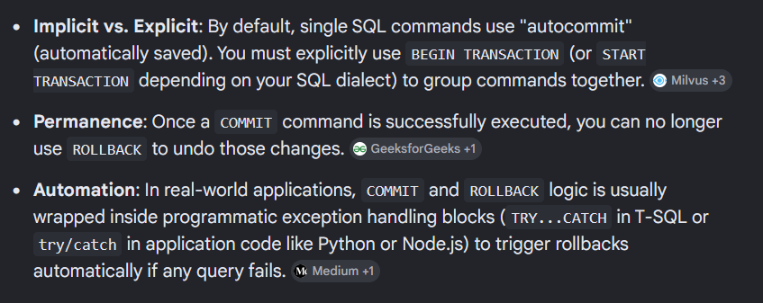

## Day 12

### Task 1: Why is there a  need for DBMS?
A Database Management System (DBMS) is needed to store, organize, and manage large amounts of data safely and efficiently. 
Key reasons include reducing data duplication, ensuring data security, and allowing multi-user access without conflicts.

### Task 2: Why not traditional DBMS? 
Traditional DBMS systems fall short in modern applications due to scalability constraints, schema rigidity, and handling unstructured data. 
Limitations of Traditional DBMS
Vertical Scaling Limits: Traditional relational databases scale up by adding more power to a single server, which becomes expensive and hits a physical ceiling.
Rigid Schemas: Predefined table structures make altering data models slow and disruptive to live applications.
Unstructured Data Bottlenecks: Tables struggle to store raw formats like audio, video, or deep nested JSON objects efficiently.


### Task 3: Data Independence in DBMS

**Data independence** is the ability to modify the database structure without affecting application programs.

* **Physical Data Independence:** Changes in physical storage (e.g., indexing, file organization) do not affect the logical structure.
* **Logical Data Independence:** Changes in the logical structure (e.g., adding/removing attributes or tables) do not affect user applications.


### Task 4: Types of Database Models

**1. Hierarchical Model**

* Organizes data in a tree structure (parent-child relationship).
* **Example:** Company → Department → Employee.

**2. Network Model**

* Allows a record to have multiple parent and child records.
* **Example:** A student can enroll in multiple courses, and each course has many students.

**3. Relational Model**

* Stores data in tables (rows and columns) with relationships using keys.
* **Example:** Student and Course tables linked by Student ID.

**4. Object-Oriented Model**

* Stores data as objects with attributes and methods.
* **Example:** A `Car` object containing model, color, and engine details.


### Task 5: Concurrency Control in DBMS

**Concurrency control** manages simultaneous access to the database by multiple users while maintaining data consistency.

**Importance:**

* Prevents data inconsistency.
* Avoids conflicts like lost updates and dirty reads.
* Ensures database integrity and correctness.


### Task 6: Indexes in DBMS

**Indexes** are special data structures that speed up data retrieval by reducing the number of records searched.

**How they improve performance:**

* Enable faster searching and sorting.
* Reduce disk I/O operations.
* Improve query execution speed, especially for large tables.


**Deadlock Prevention:**

* Acquire resources in a fixed order.
* Prevent circular waiting.
* Use transaction timeouts.

**Deadlock Detection:**

* Use a wait-for graph to identify cycles.
* Abort or roll back one transaction to break the deadlock.


### Task 8: Relational Model

The **Relational Model** is a database model that stores data in **tables (relations)** consisting of **rows (tuples)** and **columns (attributes)**. 
Tables are connected using **keys**, making it easy to store, retrieve, and manage related data while maintaining data integrity.


### Task 9: Key Terms in RDBMS

* **Row (Tuple):** A single record in a table.
* **Column (Attribute):** A field that describes a property of the data.
* **Primary Key:** A unique identifier for each record in a table.
* **Foreign Key:** A field that links one table to another.
* **Candidate Key:** A column (or set of columns) that can uniquely identify a record.
* **Super Key:** A set of one or more attributes that uniquely identifies a record.
* **Composite Key:** A key made up of two or more columns.
* **Schema:** The overall structure or design of the database.
* **Constraint:** Rules that ensure data accuracy and integrity (e.g., NOT NULL, UNIQUE, CHECK).

 
### Task 10: Different Types of Keys in RDBMS

* **Primary Key:** Uniquely identifies each record in a table. It cannot contain NULL values.
* **Foreign Key:** A field that links one table to the primary key of another table.
* **Candidate Key:** A column or set of columns that can uniquely identify a record.
* **Super Key:** A set of one or more attributes that uniquely identifies a record.
* **Composite Key:** A key formed by combining two or more columns to uniquely identify a record.
* **Alternate Key:** A candidate key that is not chosen as the primary key.
* **Unique Key:** Ensures that all values in a column are unique. It may allow a NULL value (depending on the DBMS).





### Task 11: Task 11:As you know diff keys in RDBMS what is the difference between primary key, foreign key, and unique key?

Primary key identifies each record in the current table, the same col data can be present in another table but it not uniquely identify a row in that table, these are called foreign keys, Unique keys are those which only allow unique values for a given attribute it may or may not allow `NULL` values according to implementation and setup.


### Task 12: How does transaction management work in DBMS? Give an example of commit and rollback 

It is used to perform a set of operations or queries and allows us to rollback to the State before transaction started if anything goes wrong. com 



```sql
-- Start the transaction block
BEGIN TRANSACTION; 

-- Step 1: Deduct $100 from Account A
UPDATE accounts 
SET balance = balance - 100 
WHERE account_id = 1;

-- Step 2: Add $100 to Account B
UPDATE accounts 
SET balance = balance + 100 
WHERE account_id = 2;

-- Both updates succeeded, save the data permanently
COMMIT; 

```


```sql
-- Start the transaction block
BEGIN TRANSACTION; 

-- Step 1: Deduct $100 from Account A
UPDATE accounts 
SET balance = balance - 100 
WHERE account_id = 1;

-- SYSTEM CRASHES HERE OR STEP 2 FAILS --
-- Step 2 fails because Account 9999 does not exist
UPDATE accounts 
SET balance = balance + 100 
WHERE account_id = 9999; 

-- An error is detected, cancel all changes made since BEGIN
ROLLBACK; 
```
### Task 13: Normalization in DBMS

**Normalization** is the process of organizing data in a database to reduce redundancy and improve data integrity by dividing data into related tables.

**Why is it necessary?**

* Reduces data duplication.
* Eliminates insertion, update, and deletion anomalies.
* Improves data consistency and integrity.
* Makes the database easier to maintain and manage.
* Optimizes storage and database performance.


### Task 14: What do you understand by 1NF

Databases folowing 1NF should:
1. All columns smust contain atomix values
2. Each row is unique 
3. Each column has a unique name.


### Task 15: What do you understand by 2NF

>To have no partial dependency
All non prime attribute should depend on the entire primary key and not a part of it.
ie(if there is a primary composite key with 2 keys, all the column should depend on both the cols of primary key)

### Task 16: What do you understand by 3NF
>To have no transitive dependency
Non prime attributes should not depend on other non prime attributes.
eg:(student_id,student_name,course_id,course_name)
here even tho course_name depends on student_id, it also depends on course_id so its not in 3NF


# Task 17: JOIN in **SQL**
In SQL, a **JOIN** is used to combine rows from two or more tables based on a related column between them. Joins allow you to retrieve related data stored in different tables.

For example, consider these two tables:

### Employee Table

| Emp_ID | Name    | Dept_ID |
| ------ | ------- | ------- |
| 1      | Alice   | 101     |
| 2      | Bob     | 102     |
| 3      | Charlie | 103     |
| 4      | David   | NULL    |

### Department Table

| Dept_ID | Department |
| ------- | ---------- |
| 101     | HR         |
| 102     | IT         |
| 104     | Finance    |


---

## 1. INNER JOIN

An **INNER JOIN** returns only the rows that have matching values in both tables.

**Syntax:**

```sql
SELECT e.Emp_ID, e.Name, d.Department
FROM Employee e
INNER JOIN Department d
ON e.Dept_ID = d.Dept_ID;
```

**Result:**

| Emp_ID | Name  | Department |
| ------ | ----- | ---------- |
| 1      | Alice | HR         |
| 2      | Bob   | IT         |

**Explanation:**

* Alice matches Department 101 → HR.
* Bob matches Department 102 → IT.
* Charlie (103) has no matching department.
* David has no department ID.

---

## 2. LEFT JOIN (LEFT OUTER JOIN)

A **LEFT JOIN** returns all rows from the left table and the matching rows from the right table. If no match exists, the right-side columns contain `NULL`.

**Syntax:**

```sql
SELECT e.Emp_ID, e.Name, d.Department
FROM Employee e
LEFT JOIN Department d
ON e.Dept_ID = d.Dept_ID;
```

**Result:**

| Emp_ID | Name    | Department |
| ------ | ------- | ---------- |
| 1      | Alice   | HR         |
| 2      | Bob     | IT         |
| 3      | Charlie | NULL       |
| 4      | David   | NULL       |

**Explanation:**

* All employees are shown.
* Employees without matching departments get `NULL`.

---

## 3. RIGHT JOIN (RIGHT OUTER JOIN)

A **RIGHT JOIN** returns all rows from the right table and matching rows from the left table. If no match exists, the left-side columns contain `NULL`.

**Syntax:**

```sql
SELECT e.Emp_ID, e.Name, d.Department
FROM Employee e
RIGHT JOIN Department d
ON e.Dept_ID = d.Dept_ID;
```

**Result:**

| Emp_ID | Name  | Department |
| ------ | ----- | ---------- |
| 1      | Alice | HR         |
| 2      | Bob   | IT         |
| NULL   | NULL  | Finance    |

**Explanation:**

* Every department appears.
* Finance has no employee, so employee columns are `NULL`.

---

## 4. FULL OUTER JOIN

A **FULL OUTER JOIN** returns all rows from both tables. Matching rows are combined, and non-matching rows contain `NULL` for the missing side.

**Syntax:**

```sql
SELECT e.Emp_ID, e.Name, d.Department
FROM Employee e
FULL OUTER JOIN Department d
ON e.Dept_ID = d.Dept_ID;
```

**Result:**

| Emp_ID | Name    | Department |
| ------ | ------- | ---------- |
| 1      | Alice   | HR         |
| 2      | Bob     | IT         |
| 3      | Charlie | NULL       |
| 4      | David   | NULL       |
| NULL   | NULL    | Finance    |

---

## 5. CROSS JOIN

A **CROSS JOIN** returns the Cartesian product of both tables, meaning every row from the first table is paired with every row from the second table.

**Syntax:**

```sql
SELECT e.Name, d.Department
FROM Employee e
CROSS JOIN Department d;
```

If there are 4 employees and 3 departments:

**Rows returned = 4 × 3 = 12**

Example:

| Employee | Department |
| -------- | ---------- |
| Alice    | HR         |
| Alice    | IT         |
| Alice    | Finance    |
| Bob      | HR         |
| Bob      | IT         |
| ...      | ...        |

---

## 6. SELF JOIN

A **SELF JOIN** joins a table with itself. It is commonly used when rows in the same table are related, such as employees and their managers.

### Employee Table

| Emp_ID | Name    | Manager_ID |
| ------ | ------- | ---------- |
| 1      | Alice   | NULL       |
| 2      | Bob     | 1          |
| 3      | Charlie | 1          |
| 4      | David   | 2          |

**Query:**

```sql
SELECT e.Name AS Employee,
       m.Name AS Manager
FROM Employee e
LEFT JOIN Employee m
ON e.Manager_ID = m.Emp_ID;
```

**Result:**

| Employee | Manager |
| -------- | ------- |
| Alice    | NULL    |
| Bob      | Alice   |
| Charlie  | Alice   |
| David    | Bob     |

---

## Summary Table

| Join Type           | Returns                                                     |
| ------------------- | ----------------------------------------------------------- |
| **INNER JOIN**      | Only matching rows from both tables                         |
| **LEFT JOIN**       | All rows from the left table + matching rows from the right |
| **RIGHT JOIN**      | All rows from the right table + matching rows from the left |
| **FULL OUTER JOIN** | All rows from both tables                                   |
| **CROSS JOIN**      | Every combination of rows from both tables                  |
| **SELF JOIN**       | A table joined with itself                                  |

### Quick way to remember

* **INNER JOIN** → Common records only.
* **LEFT JOIN** → Keep everything from the left table.
* **RIGHT JOIN** → Keep everything from the right table.
* **FULL OUTER JOIN** → Keep everything from both tables.
* **CROSS JOIN** → Every possible combination.
* **SELF JOIN** → Join a table to itself.
