## Day 13

### Task 1: What is an ER diagram 
An ER diagram (Entity Relationship Diagram) is a visual representation that illustrates how different entities, such as people or objects, relate to each other within a system. It is commonly used in database design to help organize and structure data effectively.

### Task 2: What do you understand by indexing in DBMS? How does it work?

**Indexing** in a **Database Management System (DBMS)** is a technique used to **speed up data retrieval** from a database table. It creates a separate data structure (called an **index**) that stores the values of one or more columns along with pointers to the corresponding rows.

* When an index is created on a column, the DBMS stores the indexed values in a sorted structure (such as a **B-tree** or **Hash index**).
* During a search, the DBMS looks up the value in the index instead of scanning every row in the table.
* The index points directly to the required record, making data retrieval much faster.

### Task 3: Do you think Indexing strategy improves the query  performance ? explain .
Yes, as Indexing uses some form of speeding up the lookup be it hashed index or b tree, among other things, it is faster than linear search or other exhaustive methods so query's worst case time complexity is improved.

### Task 4:  **ACID Properties in RDBMS**

**ACID** ensures reliable and consistent database transactions.

* **Atomicity:** A transaction is completed fully or not at all.
* **Consistency:** Keeps the database in a valid state before and after a transaction.
* **Isolation:** Multiple transactions do not interfere with each other.
* **Durability:** Once committed, data is permanently saved, even after a system failure.

**Summary:** ACID properties ensure data accuracy, reliability, and integrity in an RDBMS.

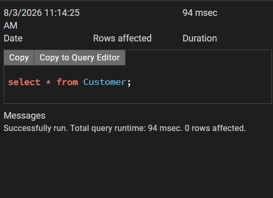

### Task 5: Alter a table to add a column with unique key

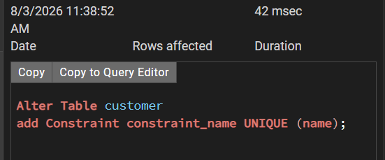

### Task 6: to add check constraint

### Task 7: 

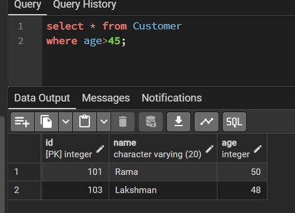

### Task 8:

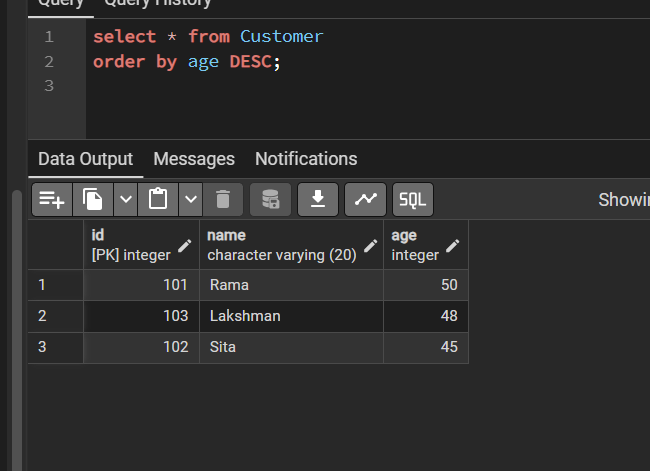

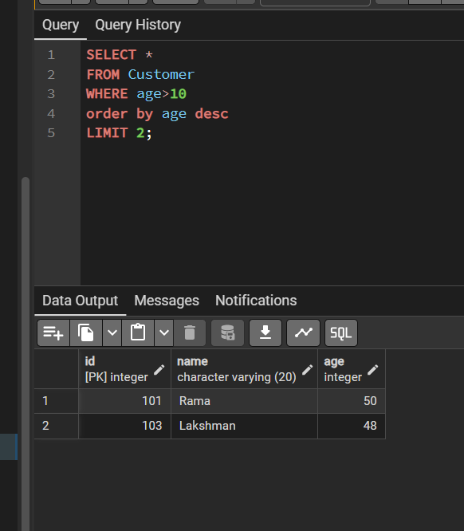

### Inner Join 

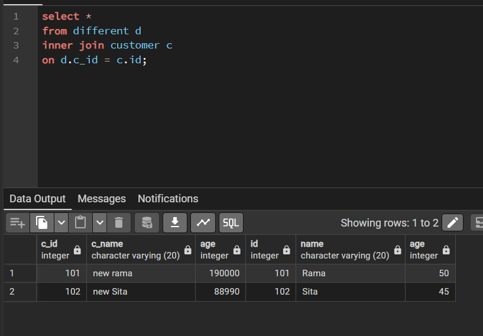

### Right Outer Join

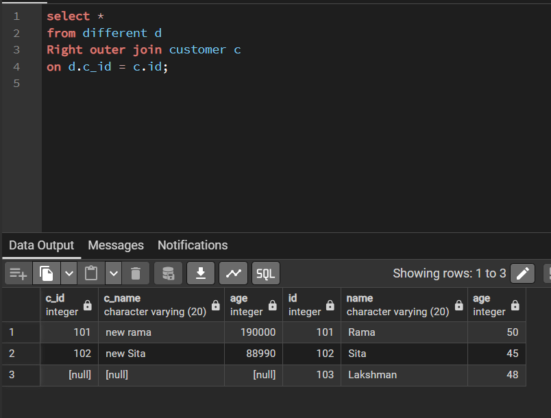

### Right Join

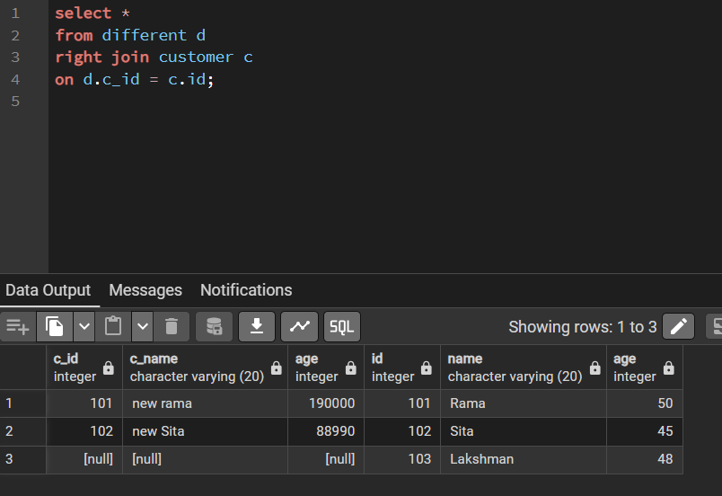

### Left Outer Join

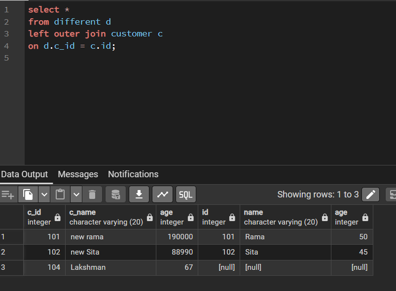

### Left Join 

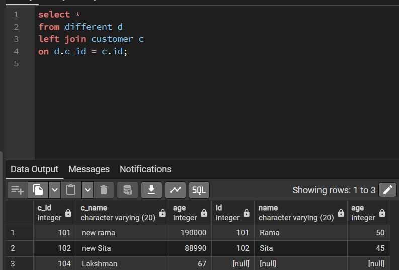

### Full Join

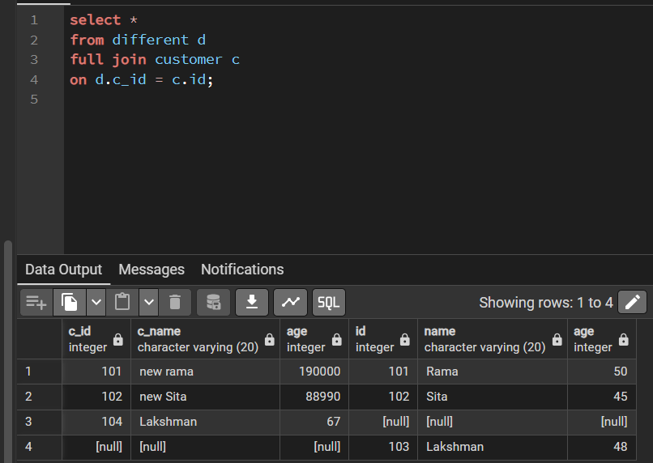

### Cross Join

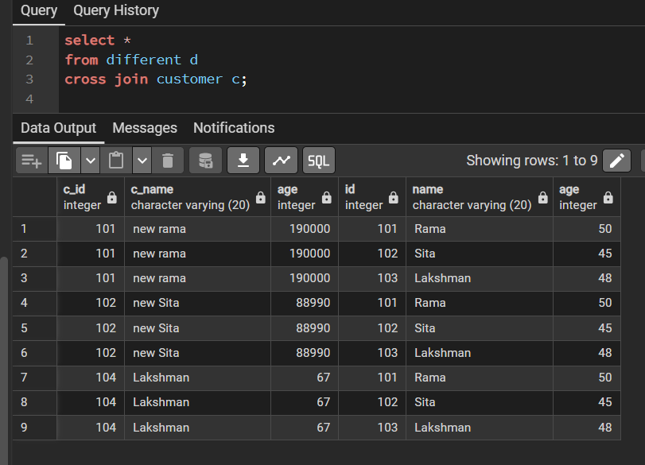

## Indexing 

eg usage of index and performance slightly faster ig almost runs within 4-5 ms 

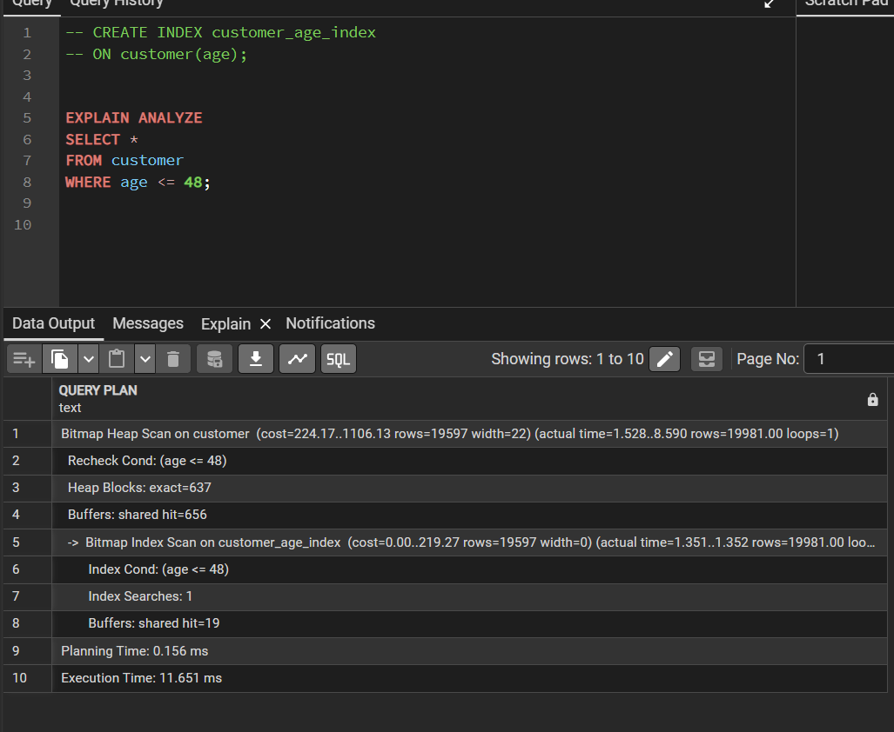

comparing without indexing: on avg its taking 8-9 ms

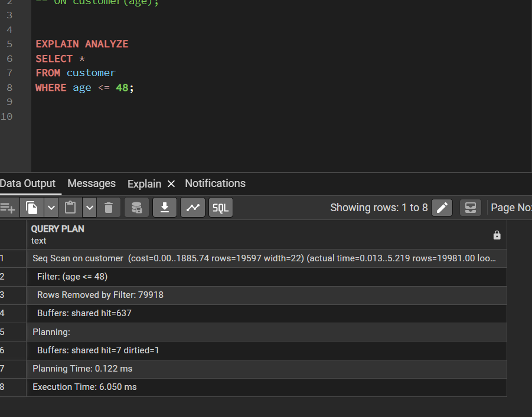
