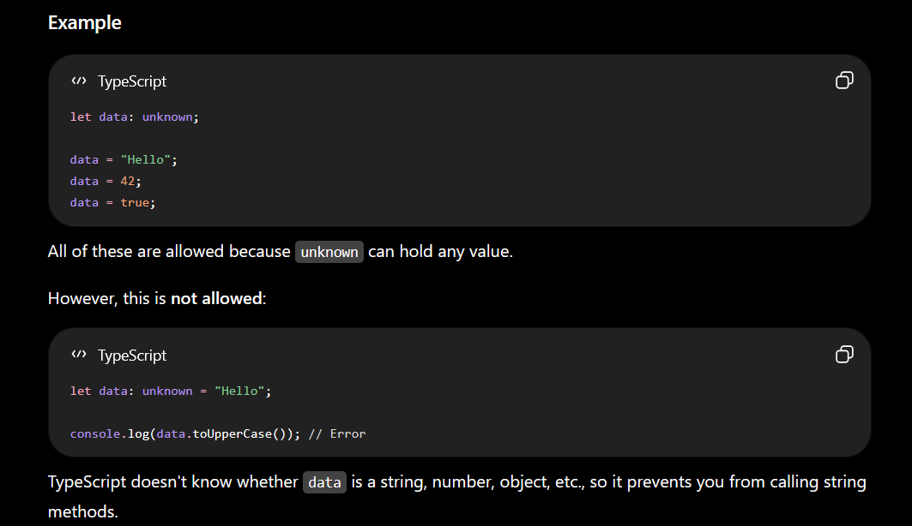
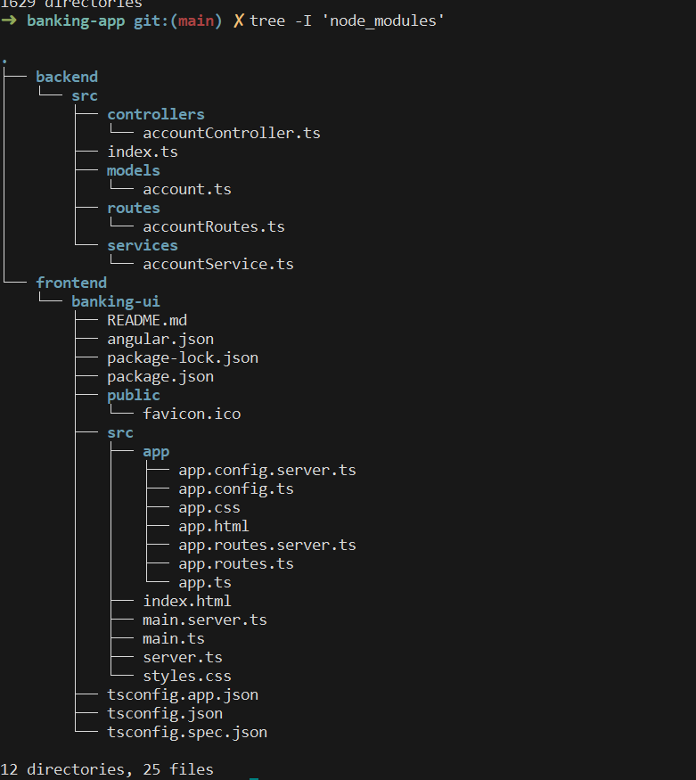

### Task 1: What do you understand about Git collaboration?
Git collaboration is the process where multiple developers work simultaneously on a shared codebase using Git's distributed version control mechanics. It provides a structured framework that allows teams to write code, review changes, and track software history without overwriting each other's work.


### Task 2: Why is collaboration necessary while working on git?
Collaboration is necessary while working on Git because it provides a structured environment for multiple developers to simultaneously build software, maintain code quality, and prevent data loss without overwriting each other's work.

### Task 3: What are the commands that we use while collaborating?
1. git clone 
2. git pull 
3. git push 
4. git switch -c <branch-name> 

### Task 4: Can you show the typical work flow while working on Git ?
 [1. Pull Updates] ---> [2. Create Branch] ---> [3. Make Commits]
         ^                                              |
         |                                              v
 [6. Sync & Repeat] <-- [5. Merge to Main] <-- [4. Push & Review]


### Task 5: Give some to do practices that we need to follow while working on Git Repo on a daily basis.
`git pull` daily: Always update code first thing to avoid conflicts.
Use branches: Never work directly on main; create feature branches.
`Commit` often: Save small, logical snapshots instead of one massive dump.
Write clear messages: Explain what the commit fixes or adds.
`git status` first: Double-check your files before staging them.
`git push` nightly: Upload your progress to back it up.


[Link to project](../../source_code/TypeScript/demo)
### Task 6: Demo TypeScript file

`demo.ts`

```ts
let message: string = "Hello TypeScript";

console.log(message);
```

Run:

```bash
tsc demo.ts
node demo.js
```


### Task 7: Interface example

```ts
interface User {
    name: string;
    age: number;
}

const user: User = {
    name: "Alice",
    age: 25
};

console.log(user);
```


### Task 8: Optional variable/property

Use `?` to make a property optional:

```ts
interface User {
    name: string;
    age?: number;
}

const user1: User = {
    name: "Bob"
};

const user2: User = {
    name: "Alice",
    age: 30
};

console.log(user1, user2);
```


### Task 9: Constructors

```ts
class Person {
    name: string;
    age: number;

    // Default constructor
    constructor() {
        this.name = "Unknown";
        this.age = 0;
    }
}

const person1 = new Person();

console.log(person1);
```

Parameterized constructor:

```ts
class Student {
    name: string;
    age: number;

    constructor(name: string, age: number) {
        this.name = name;
        this.age = age;
    }
}

const student = new Student("John", 20);

console.log(student);
```


### Task 10: TypeScript data types


**Primitive types:**

| Type        | Example            |
| ----------- | ------------------ |
| `string`    | `"hello"`          |
| `number`    | `42`, `3.14`       |
| `boolean`   | `true`, `false`    |
| `bigint`    | `100n`             |
| `symbol`    | `Symbol("id")`     |
| `undefined` | `let x: undefined` |
| `null`      | `let y: null`      |

**Special types:**

| Type      | Purpose                                      |
| --------- | -------------------------------------------- |
| `any`     | Disables type checking                       |
| `unknown` | Safer alternative to `any`                   |
| `void`    | Function returns nothing                     |
| `never`   | Function never completes (throws/error/loop) |
| `object`  | Represents non-primitive objects             |
| `tuple`   | Fixed-length array with specific types       |


### Task 13
Generics allow us to create reusable code that works with different data types while keeping type safety.
```ts
function printValue<T>(value: T): T {
    return value;
}

let name = printValue<string>("John");

let age = printValue<number>(25);

console.log(name);
console.log(age);
```

### Task 14: What are type annotations in typescript?

Type annotations in TypeScript are used to explicitly specify the type of a variable, function parameter, or object property. This helps catch errors early, improves code readability, and ensures type safety.

### Task 15: What is the purpose of the any keyword in typescript?

In TypeScript, the any keyword is used to opt out of type checking for a value. A variable declared with type any can hold any kind of value, and TypeScript will allow you to perform almost any operation on it without reporting type errors.


### Task 16: What is the purpose of the any keyword in typescript?



### Task 17: What is the tsconfig.json file used for ?

The tsconfig.json file marks the root of a TypeScript project and tells the TypeScript compiler (tsc) how to turn your code into JavaScript. It sets rules for project files, type safety, and target environments.


### Task 18




