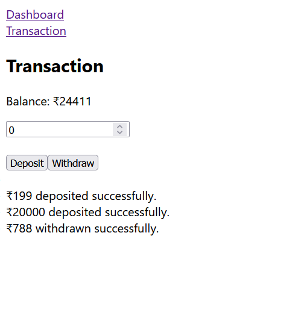
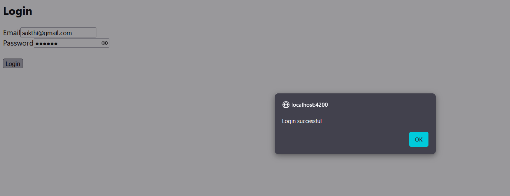

## Day 15 

### Task 1: What is angular? Explain briefly.
Angular is a framework and development platform, built on TypeScript. It is used for creating single-page web applications. As a platform, Angular includes:

* A component-based framework for building scalable web applications
* A collection of well-integrated libraries that cover a wide variety of features, including routing, forms management, client-server communication, and more
* A suite of developer tools to help you develop, build, test, and update your code

### Task 2: What is Data Binding? Explain.

**Data Binding:**
Data binding is the process of connecting the component (TypeScript) with the view (HTML) so that data is synchronized automatically.

**Types of Data Binding (4 Types):**

1. **Interpolation (`{{ }}`):** Displays data from the component to the view.
2. **Property Binding (`[ ]`):** Binds component properties to HTML element properties.
3. **Event Binding (`( )`):** Calls a component method when an event (like a click) occurs.
4. **Two-Way Data Binding (`[( )]`):** Synchronizes data between the component and the view.

---

### Task 3: Why do we need Angular? What are its advantages?

Angular is used to build fast, dynamic, and single-page web applications.

1. **Component-Based:** Promotes reusable and maintainable code.
2. **Two-Way Data Binding:** Automatically updates the UI when data changes.
3. **Routing:** Enables navigation without reloading the page.
4. **TypeScript Support:** Improves code quality and makes debugging easier.

---

### Task 4: What is REST API?

1. REST API is a way for applications to communicate over the internet.
2. It uses HTTP methods like **GET, POST, PUT, and DELETE**.
3. It usually exchanges data in **JSON** format.
4. It is commonly used to connect the front-end with the back-end.

---

### Task 5: Why do we use REST API?

1. To exchange data between the client and the server.
2. It is fast, lightweight, and easy to use.
3. It is platform-independent and works with different applications.
4. It supports standard HTTP methods for CRUD operations.

---

### Task 6: What are Single Page Applications (SPA)?

1. A Single Page Application (SPA) loads a single HTML page initially.
2. It updates content dynamically without refreshing the entire page.
3. SPAs provide a faster and smoother user experience.
4. Angular is commonly used to build Single Page Applications.


--- 

### Task 7: Explain Modules, Components, and Services in Angular

**1. Module**

* A module organizes related components, directives, pipes, and services.
* The main module of an Angular application is **AppModule**.

**2. Component**

* A component controls a part of the user interface (UI).
* It consists of an HTML template, CSS styles, and a TypeScript class.

**3. Service**

* A service contains reusable business logic or data.
* It is shared across components using **Dependency Injection (DI)**.

---

### Task 8: Explain the Types of Data Binding

**1. Property Binding (`[ ]`)**

* Binds data from the component to an HTML element property.
* Used to set values dynamically.
* Example: `[src]="imageUrl"`

**2. Event Binding (`( )`)**

* Binds an HTML event to a component method.
* Used to handle user actions like clicks.
* Example: `(click)="save()"`

**3. String Interpolation (`{{ }}`)**

* Displays component data in the HTML.
* One-way binding from component to view.
* Example: `{{ username }}`

**4. Two-Way Data Binding (`[( )]`)**

* Synchronizes data between the component and the view.
* Commonly used with `ngModel`.
* Example: `[(ngModel)]="name"`

---

### Task 9: What are Decorators? Explain the Types of Decorators.

**Decorators**

* Decorators are special functions that provide metadata to Angular classes.
* They tell Angular how a class, property, or method should behave.

**Types of Decorators**

1. **Class Decorators** – `@Component`, `@NgModule`, `@Injectable`.
2. **Property Decorators** – `@Input`, `@Output`.
3. **Method Decorators** – `@HostListener`.
4. **Parameter Decorators** – `@Inject`.

---

### Task 10: What are Annotations in Angular?

1. Annotations are metadata added to classes using decorators.
2. They tell Angular how to process a class or component.
3. Examples include `@Component`, `@NgModule`, and `@Injectable`.
4. They help Angular identify components, modules, and services during application execution.


### **Task 11: Explain the Angular Parent-Child Component code snippet**

This code demonstrates **communication between a parent component and a child component using `@Input()`**.

* The **ParentComponent** has a variable called `parentMessage` that stores the message.
* In the parent template, the child component is called using:

  ```html
  <app-child [childMessage]="parentMessage"></app-child>
  ```
* The value of `parentMessage` is passed from the parent component to the child component through the `childMessage` property.
* In the child component, `@Input()` receives the value and displays it using interpolation:

  ```html
  Say {{ childMessage }}
  ```
* Output will be:

  ```
  Say message from parent
  ```

---

### **Task 12: Create a TypeScript class with a constructor and a function**

Example:

```typescript
class Employee {
  name: string;
  age: number;

  constructor(name: string, age: number) {
    this.name = name;
    this.age = age;
  }

  displayDetails() {
    console.log(`Name: ${this.name}, Age: ${this.age}`);
  }
}

let emp = new Employee("John", 30);
emp.displayDetails();
```

Explanation:

* The constructor initializes the object values when a new object is created.
* The `displayDetails()` function performs an action using the class properties.
* An object `emp` is created using the `Employee` class.

---

### **Task 13: What are eager loading and lazy loading?**

**Eager Loading:**

* Eager loading loads modules or resources immediately when the application starts.
* It is useful for small applications where all features are required quickly.
* Example: Angular loads the main module and its dependencies at startup.

**Lazy Loading:**

* Lazy loading loads modules only when they are required.
* It improves application performance by reducing the initial loading time.
* Example: Loading a feature module only when the user navigates to a specific route.

---

### **Task 14: What is an observable response?**

* An **Observable** is a feature in Angular (from RxJS) used to handle asynchronous operations like HTTP calls, events, and data streams.
* It emits data over time and allows components to subscribe and receive updates.
* Example: An HTTP request returns an Observable response, and the component subscribes to get the data.

Example:

```typescript
this.http.get('api/users').subscribe(response => {
  console.log(response);
});
```

Here, the API response is received asynchronously through the Observable subscription.


### Task 15: Angular Flow

[index.html] <app-root>
     │
     └──> [main.ts] (Launches the app)
               │
               └──> [app.module.ts] (Declares rules & imports)
                         │
                         └──> [app.component.ts] (Injects HTML/CSS into <app-root>)




Task of the day 
(Link to Project)[../../source_code/TypeScript/banking-app/frontend/banking-ui]



