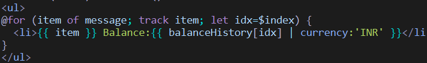
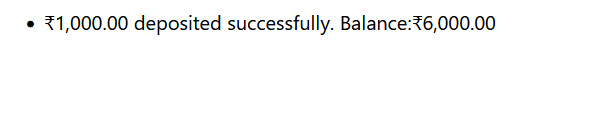
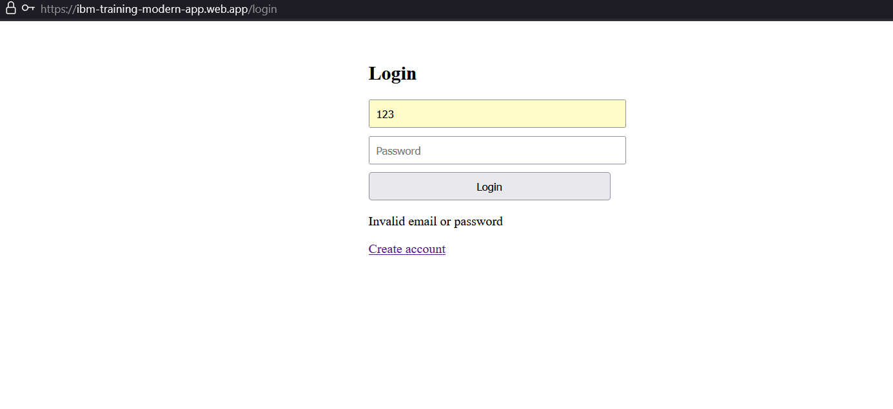

## Day 16

### Task 2: **Also use currency pipe for the amount.**

[Link to project](../../source_code/TypeScript/banking-app/frontend/banking-ui/src/app/transaction/transaction.component.ts)

Output: 

CurrencyPipe usage outside template: 

### Module: 
1. Create authentication for your account’s id and password..
2. Create  auth.module.ts  for your login and register components.ts

[To use NG module architecture, `standalone:false` components ](../../source_code/TypeScript/app-module)

### Firebase Deploy : 

