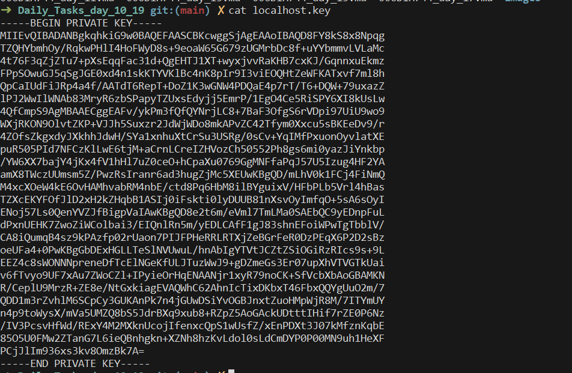
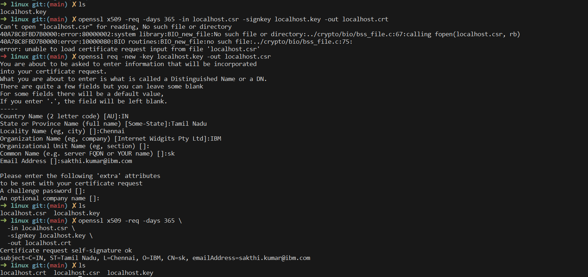

### Task 1:

4. 
to delete every line containing john we use this command 
```bash
sed '/John/d' filename.txt
```
5. 
To print the contents of `line 3` we use this command  
```bash
sed -n '3p' filename.txt
```

```bash
# See the file
cat filename.txt

# 1. Print file using sed
sed filename.txt

# 2. Replace first "apples" on each line
sed 's/apples/bananas/' filename.txt

# 3. Replace ALL "apples"
sed 's/apples/bananas/g' filename.txt

# 4. Delete lines containing "John"
sed '/John/d' filename.txt

# 5. Print only line 3
sed -n '3p' filename.txt
```


### Task 2:
`awk 'END {print NR}' filename`
prints the record number of the last line ie the total no of lines or the line number of the last line 


### Task 3: SSL Certificate








Below are concise, interview/class-friendly answers for **Tasks 5–12**, with Java examples where requested.

## Task 5 — What are trees? Where do you implement them?

A **tree** is a non-linear data structure made up of **nodes** connected by edges. It starts with a top node called the **root**, and each node can have zero or more child nodes.

Trees are commonly used in:

* File and folder systems
* Database indexing
* HTML/XML document structure (DOM)
* Searching and sorting
* AI decision trees
* Network routing

**Example:**

```text
        10          ← Root
       /  \
      5    20       ← Children
     / \     \
    2   7     30
```

---

## Task 6 — Types of trees

Some common types of trees are:

1. **General Tree** – A node can have any number of children.
2. **Binary Tree** – Each node can have at most two children.
3. **Binary Search Tree (BST)** – A binary tree where smaller values go to the left and larger values go to the right.
4. **AVL Tree** – A self-balancing binary search tree.
5. **Red-Black Tree** – A self-balancing BST that uses colors to maintain balance.
6. **Heap** – A tree-based structure commonly used to implement priority queues.
7. **B-Tree** – A multi-way balanced tree commonly used in databases and file systems.

---

## Task 7 — What is a Binary Search Tree?

A **Binary Search Tree (BST)** is a binary tree that follows this rule:

* Values **smaller** than a node are stored in its **left subtree**.
* Values **greater** than a node are stored in its **right subtree**.
* Usually, duplicate values are either not allowed or handled using a defined convention.

For example, inserting `50, 30, 70, 20, 40` gives:

```text
        50
       /  \
     30    70
    /  \
   20   40
```

This arrangement makes searching efficient when the tree is reasonably balanced.

---

# Task 8 — Create a simple Binary Search Tree and insert values

Here is a simple Java implementation:

```java
class Node {
    int val;
    Node left, right;

    Node(int val) {
        this.val = val;
    }
}

class BinarySearchTree {

    Node root;

    // Insert a value
    Node insert(Node node, int val) {

        if (node == null) {
            return new Node(val);
        }

        if (val < node.val) {
            node.left = insert(node.left, val);
        } else if (val > node.val) {
            node.right = insert(node.right, val);
        }

        return node;
    }

    void insert(int val) {
        root = insert(root, val);
    }

    // Display tree using inorder traversal
    void display(Node node) {
        if (node == null) {
            return;
        }

        display(node.left);
        System.out.print(node.val + " ");
        display(node.right);
    }

    public static void main(String[] args) {

        BinarySearchTree tree = new BinarySearchTree();

        tree.insert(50);
        tree.insert(30);
        tree.insert(70);
        tree.insert(20);
        tree.insert(40);
        tree.insert(60);
        tree.insert(80);

        System.out.println("Tree values:");
        tree.display(tree.root);
    }
}
```

The resulting tree is:

```text
          50
        /    \
      30      70
     /  \    /  \
   20   40  60   80
```

The `insert()` method decides where to put each value:

```java
if (val < node.val)
    node.left = insert(node.left, val);
else
    node.right = insert(node.right, val);
```

So, **smaller values go left and larger values go right**.

---

# Task 9 — Search for a number in the BST

We can extend the previous code with a `search()` method:

```java
boolean search(Node node, int val) {

    if (node == null) {
        return false;
    }

    if (node.val == val) {
        return true;
    }

    if (val < node.val) {
        return search(node.left, val);
    } else {
        return search(node.right, val);
    }
}
```

Then use it in `main()`:

```java
public static void main(String[] args) {

    BinarySearchTree tree = new BinarySearchTree();

    tree.insert(50);
    tree.insert(30);
    tree.insert(70);
    tree.insert(20);
    tree.insert(40);
    tree.insert(60);
    tree.insert(80);

    int number = 60;

    if (tree.search(tree.root, number)) {
        System.out.println(number + " found in the tree");
    } else {
        System.out.println(number + " not found in the tree");
    }
}
```

### How does searching work?

Suppose we search for `60`:

```text
        50
       /  \
     30    70
          /
         60
```

1. `60 > 50` → go right.
2. `60 < 70` → go left.
3. `60 == 60` → found.

This avoids checking every node in a properly balanced BST.

---

# Task 10 — Inorder traversal in a BST

**Inorder traversal** means:

```text
Left → Root → Right
```

Java code:

```java
void inorder(Node node) {

    if (node == null) {
        return;
    }

    inorder(node.left);
    System.out.print(node.val + " ");
    inorder(node.right);
}
```

For this tree:

```text
          50
        /    \
      30      70
     /  \    /  \
   20   40  60   80
```

The inorder traversal is:

```text
20 30 40 50 60 70 80
```

### Important point

**Inorder traversal of a BST produces the values in sorted order.**

---

# Task 11 — Fundamental difference between BFS and DFS

The main difference is **how they explore the tree/graph**.

### BFS — Breadth-First Search

BFS explores **level by level**.

```text
        1
       / \
      2   3
     / \
    4   5
```

BFS order:

```text
1 → 2 → 3 → 4 → 5
```

It first visits the root, then all its immediate children, then the next level.

### DFS — Depth-First Search

DFS explores **as far as possible along one branch before backtracking**.

One possible DFS order:

```text
1 → 2 → 4 → 5 → 3
```

So the fundamental difference is:

> **BFS explores breadth/levels first, while DFS explores depth/branches first.**

---

# Task 12 — Which data structures are used to implement BFS and DFS?

> BFS → Queue

BFS uses a **Queue**, because nodes are processed in **First In, First Out (FIFO)** order.

> DFS → Stack

DFS uses a **Stack**, because nodes are processed in **Last In, First Out (LIFO)** order.

## Task 13 — How do you find the shortest path in an unweighted graph?

Use **BFS (Breadth-First Search)**.

BFS visits nodes level by level, so the **first time we reach a node, we have found the shortest path** from the source in terms of number of edges.

Example:

```text
A → B → D
 \       ↑
  → C →──
```

Starting from `A`, BFS checks `B` and `C` first, then reaches `D`.

**Key point:**

> For an unweighted graph, **BFS finds the shortest path in O(V + E)**.

---

## Task 14 — How do you detect a cycle in a graph?

It depends on whether the graph is **directed or undirected**.

### Undirected graph

Use **DFS/BFS with a visited set and parent tracking**. If we encounter an already-visited node that is **not the parent**, a cycle exists.

### Directed graph

Use **DFS with a recursion stack**. If we reach a node that is already in the current recursion path, a cycle exists.

**Interview answer:**

> We can detect cycles using DFS. In an undirected graph, a visited neighbor that isn't the parent indicates a cycle. In a directed graph, a back edge to a node currently in the recursion stack indicates a cycle.

---

# Task 15 — Explain the internal working of a HashMap

A Java `HashMap` stores data as **key-value pairs**.

When we do:

```java
map.put("Apple", 100);
```

the basic process is:

1. Java calculates the **hash code** of the key.
2. The hash is used to determine a **bucket/index**.
3. The key-value pair is stored in that bucket.
4. During `get()`, Java calculates the hash again and searches the appropriate bucket.
5. If multiple keys land in the same bucket, Java handles the **collision** using a linked structure and, in modern Java, may convert a heavily populated bucket into a tree.

Example:

```text
Key → hashCode() → bucket → key/value
```

Average `put()` and `get()` operations are **O(1)**, assuming good hash distribution.

---

# Task 16 — Which property of a HashMap is used to find the intersection of two arrays?

The important property is that a `HashMap`/hash-based collection provides **fast lookup** using keys.

For example, we can store the elements of one array in a hash-based structure and check whether each element of the second array exists.

This gives approximately **O(n + m)** average time instead of comparing every element with every other element.

**Interview answer:**

> We use the **fast key lookup/search property of hashing** to efficiently find common elements between two arrays.

---

# Task 17 — What is a collision in HashMap?

A **collision** occurs when **two different keys produce the same bucket/index** in a HashMap.

For example:

```text
Key A ──→ Bucket 5
Key B ──→ Bucket 5
```

Both keys need to be stored in the same bucket.

Java handles collisions by storing multiple entries in the bucket using a linked structure and, when a bucket becomes sufficiently large, a tree structure may be used.

---

# Task 18 — How do Java's Capacity and Size of HashMap differ?

### Capacity

**Capacity** is the number of buckets available in the HashMap's internal table.

### Size

**Size** is the number of **key-value mappings currently stored** in the HashMap.

For example:

```java
HashMap<Integer, String> map = new HashMap<>(16);

map.put(1, "A");
map.put(2, "B");
```

Here, conceptually:

```text
Capacity = 16 buckets
Size     = 2 entries
```

The HashMap can automatically resize when its entries reach the **load-factor threshold**.

---

# Task 19 — Does HashMap allow null values?

**Yes.** A Java `HashMap` allows **one null key** and **multiple null values**.

Given your code:

```java
hmap.put(1, "Program to store null value");
hmap.put(null, "InterviewBit");
System.out.println(hmap);
```

The output is:

```text
{null=InterviewBit, 1=Program to store null value}
```

**Explanation:** The `null` key is valid in `HashMap`, and the map stores its associated value `"InterviewBit"`.

> Note: The exact order of entries printed should **not** be relied upon because `HashMap` does not guarantee iteration order.

---

# Task 20 — HashMaps in Java are not thread-safe. Justify.

`HashMap` is **not thread-safe** because multiple threads can access and modify the same HashMap simultaneously without built-in synchronization.

For example, if two threads perform `put()` operations at the same time, their operations can interfere with each other.

For concurrent access, Java provides alternatives such as:

```java
ConcurrentHashMap
```

**Interview answer:**

> HashMap does not provide synchronization, so concurrent modifications by multiple threads can cause inconsistent results. For thread-safe concurrent access, we can use `ConcurrentHashMap`.

---

# Task 21 — Can you store multiple keys with the same value in a HashMap?

**Yes.**

A HashMap requires **keys to be unique**, but multiple keys can have the **same value**.

Example:

```java
HashMap<Integer, String> map = new HashMap<>();

map.put(1, "Apple");
map.put(2, "Apple");
map.put(3, "Apple");

System.out.println(map);
```

Output:

```text
{1=Apple, 2=Apple, 3=Apple}
```

Here, `1`, `2`, and `3` are different keys, but all have the same value `"Apple"`.

**Key point:**

> **Keys must be unique; values do not have to be unique.**

---

# Task 22 — Difference between HashMap and Hashtable in Java

| Feature                       | HashMap          | Hashtable                                  |
| ----------------------------- | ---------------- | ------------------------------------------ |
| Thread-safe                   | ❌ No             | ✅ Synchronized                             |
| Performance                   | Generally faster | Generally slower                           |
| Null key                      | ✅ One null key   | ❌ Not allowed                              |
| Null values                   | ✅ Allowed        | ❌ Not allowed                              |
| Introduced                    | Java 1.2         | Java 1.0                                   |
| Modern concurrent alternative | —                | `ConcurrentHashMap` is generally preferred |

### Simple interview answer

> **HashMap is non-synchronized and allows one null key and multiple null values, while Hashtable is synchronized and does not allow null keys or null values. HashMap is generally preferred for non-concurrent use, while `ConcurrentHashMap` is preferred when thread-safe concurrent access is required.**


### Task: Bubble sort
```java
    void bubbleSort(int arr[])
    {
        int n = arr.length;
      
        for (int i = 0; i < n - 1; i++)
            for (int j = 0; j < n - i - 1; j++)
                if (arr[j] > arr[j + 1]) {
                  
                    // swap temp and arr[i]
                    int temp = arr[j];
                    arr[j] = arr[j + 1];
                    arr[j + 1] = temp;
                }
    }
```


### Task: Selection Sort 
```java
  void selection_sort(int a[])
    {
        int n = a.length;

        // One by one move boundary of unsorted subarray
        for (int i = 0; i < n - 1; i++) {
          
            // Find the minimum element in unsorted array
            int min_idx = i;
          
            for (int j = i + 1; j < n; j++) {
                if (a[j] < a[min_idx])
                    min_idx = j;
            }

            // Swap the found minimum element with the first
            // element
            int temp = a[min_idx];
            a[min_idx] = a[i];
            a[i] = temp;
        }
    }

```

### Task: Linear Search


```java
int search(vector<int>& arr, int x) {
    
    // Iterate over the array in order to
    // find the key x
    for (int i = 0; i < arr.size(); i++)
        if (arr[i] == x)
            return i;
    return -1;
}

```
