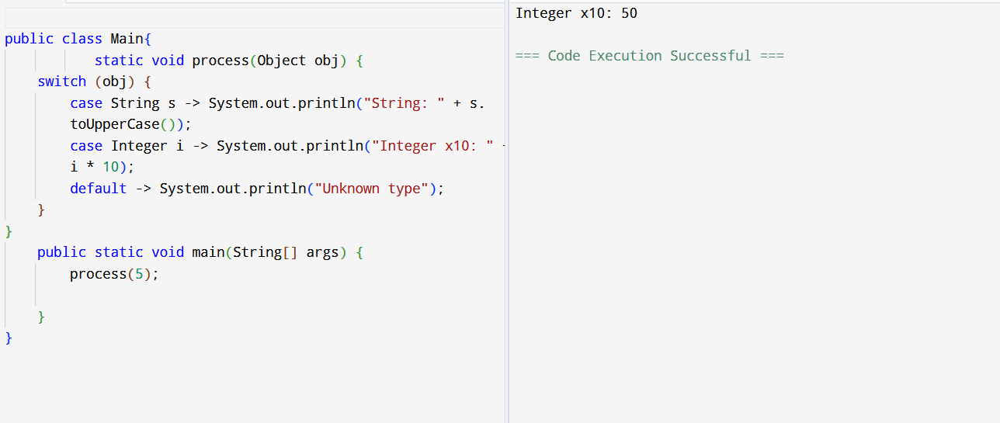
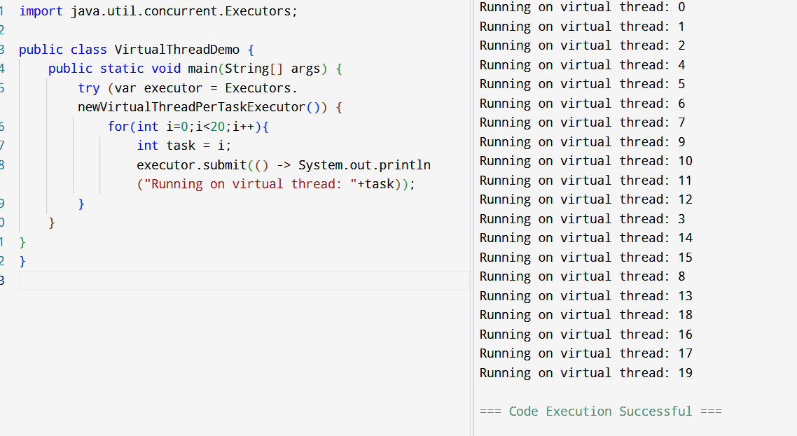

### Task 1 — What are Wrapper Classes?

**Wrapper classes** in Java are classes that convert primitive data types into objects.

Java provides a wrapper class for each primitive type:

| Primitive | Wrapper Class |
| --------- | ------------- |
| `byte`    | `Byte`        |
| `short`   | `Short`       |
| `int`     | `Integer`     |
| `long`    | `Long`        |
| `float`   | `Float`       |
| `double`  | `Double`      |
| `char`    | `Character`   |
| `boolean` | `Boolean`     |

For example:

```java
int a = 10;             // primitive
Integer b = 10;         // wrapper object
```

Wrapper classes are useful when we need to treat primitive values as **objects**, especially with collections such as `ArrayList`.

---

### Task 2 — What is Autoboxing and Unboxing?

**Autoboxing** means automatically converting a primitive value into its corresponding wrapper object.

```java
int x = 10;
Integer obj = x;   // Autoboxing
```

Here, Java automatically converts `int` into `Integer`.

**Unboxing** is the opposite: automatically converting a wrapper object back into a primitive.

```java
Integer obj = 20;
int x = obj;       // Unboxing
```

So:

```text
Primitive → Wrapper = Autoboxing
Wrapper  → Primitive = Unboxing
```

---

### Task 3 — Program demonstrating Wrapper Classes

```java
public class WrapperDemo {
    public static void main(String[] args) {

        // Autoboxing: primitive to wrapper
        int primitiveInt = 10;
        Integer wrappedInt = primitiveInt;

        System.out.println("Primitive value: " + primitiveInt);
        System.out.println("Wrapper value: " + wrappedInt);

        // Explicitly creating a wrapper object
        Integer objInt = Integer.valueOf(25);

        // Unboxing: wrapper to primitive
        int unboxedInt = objInt;

        System.out.println("Wrapper object: " + objInt);
        System.out.println("Unboxed value: " + unboxedInt);

        // Using wrapper class methods
        String number = "100";
        int convertedNumber = Integer.parseInt(number);

        System.out.println("Converted number: " + convertedNumber);
    }
}
```

**Note:** `new Integer(25)` is deprecated in modern Java. Prefer:

```java
Integer objInt = Integer.valueOf(25);
```

---

### Task 4 — Where do we use Wrapper Classes?

Wrapper classes are mainly used in situations where Java requires an **object instead of a primitive**.

#### 1. Collections

Java collections store objects, not primitive types.

```java
ArrayList<Integer> numbers = new ArrayList<>();

numbers.add(10);  
```

#### 2. Generics

Generics work with objects:

```java
List<Integer> list;
List<Double> prices;
```
#### 3. Converting Strings to primitives

Wrapper classes provide useful methods:

```java
int x = Integer.parseInt("100");
double d = Double.parseDouble("10.5");
```

#### 4. Utility methods and constants

Wrapper classes provide useful methods and constants:

```java
Integer.MAX_VALUE
Integer.MIN_VALUE
Double.isNaN(value)
```

#### 5. Working with `null`

Primitive types cannot hold `null`:

But wrapper objects can:

```java
Integer x = null;   // 
```

---

# Task 5 — Program showing Abstraction vs Encapsulation

### Abstraction

**Abstraction** means hiding implementation details and showing only the essential functionality.

For example, a user knows that a car has a `start()` operation, but doesn't need to know every internal detail of how the engine starts.

### Encapsulation

**Encapsulation** means wrapping data and methods together inside a class and controlling access to the data, usually using `private` fields and public methods.

Here's a program demonstrating both:

```java
// Abstraction using an abstract class
abstract class Vehicle {

    // Abstract method - implementation is hidden
    abstract void start();

    // Common method
    void stop() {
        System.out.println("Vehicle stopped");
    }
}

// Encapsulation using private data
class Car extends Vehicle {

    private String model;
    private int speed;

    // Constructor
    Car(String model, int speed) {
        this.model = model;
        this.speed = speed;
    }

    // Implementing abstract method
    @Override
    void start() {
        System.out.println(model + " is starting");
    }

    // Getter
    public int getSpeed() {
        return speed;
    }

    // Setter
    public void setSpeed(int speed) {
        if (speed >= 0) {
            this.speed = speed;
        }
    }
}

public class Main {
    public static void main(String[] args) {

        Car car = new Car("BMW", 60);

        // Abstraction
        car.start();
        car.stop();

        // Encapsulation
        System.out.println("Speed: " + car.getSpeed());

        car.setSpeed(100);

        System.out.println("Updated speed: " + car.getSpeed());
    }
}
```

### Difference

| Abstraction                                            | Encapsulation                                   |
| ------------------------------------------------------ | ----------------------------------------------- |
| Hides implementation details                           | Hides/protects data                             |
| Focuses on **what** an object does                     | Focuses on **how data is accessed/protected**   |
| Achieved using abstract classes/interfaces             | Achieved using access modifiers like `private`  |
| Example: `start()` without exposing its implementation | Example: `private int speed` with getter/setter |

A simple way to remember:

> **Abstraction = What to show**
> **Encapsulation = How to protect**

---

# Task 6 — What is Executor Framework in Java 5? Why and Where do we use it?

The **Executor Framework** was introduced in **Java 5** as part of `java.util.concurrent`.

It provides a higher-level way to create and manage threads instead of manually creating threads using `new Thread()`.


```java
Executors.newFixedThreadPool(3);
```

creates a thread pool containing **3 worker threads**.

The tasks are submitted to the executor:

```java
executor.submit(task);
```

The executor manages which thread executes each task.

### Why do we use it?

The Executor Framework helps us:

* Manage threads efficiently
* Reuse threads through thread pools
* Avoid creating a new thread for every task
* Execute multiple tasks concurrently
* Manage task scheduling and execution
* Improve application performance and resource utilization

### Where do we use it?

It is commonly used in:

* Web servers
* Backend applications
* Database operations
* Processing multiple files
* Parallel computations
* Asynchronous/background tasks
* Applications handling many requests

> **Executor Framework is a Java concurrency framework that manages and executes tasks using a pool of reusable threads, making multithreaded applications easier and more efficient to develop.**


Sure — here are **short notes for each task**, suitable for quick revision.

### Task 7: Executor, ExecutorService and Executors

* **Executor** is an interface used to execute tasks asynchronously.
* **ExecutorService** extends Executor and provides methods to submit, manage, and terminate tasks.
* **Executors** is a utility class used to create thread pools like `newFixedThreadPool()`.
* Example: `ExecutorService service = Executors.newFixedThreadPool(3);`

### Task 8: Callable with Future

* `Callable` is used when a task needs to **return a result**.
* `Future` is used to store and retrieve the result of a `Callable` task.
* `future.get()` gets the result and waits until the task completes.
* Example: `Future<Integer> f = executor.submit(() -> 10 + 20);`

### Task 9: ExecutorService Flow

* First, create an `ExecutorService` using `Executors`.
* Submit tasks using `execute()` or `submit()`.
* Use `Future.get()` to obtain results from submitted `Callable` tasks.
* Finally, call `shutdown()` to stop the executor.

```text
Create → Submit → Get Results → Shutdown
```

### Task 10: Character and Buffered I/O

* **Character I/O** handles text using classes like `FileReader` and `FileWriter`.
* **Buffered I/O** uses `BufferedReader` and `BufferedWriter` to improve performance.
* `BufferedReader` can read text line-by-line using `readLine()`.

```text
FileReader/FileWriter → Character I/O
BufferedReader/Writer → Buffered I/O
```

### Task 11: Object Class

* `Object` is the **root class of all Java classes**.
* Every class directly or indirectly inherits from `Object`.
* It provides common methods such as `toString()`, `equals()`, and `hashCode()`.


### Task 12: Methods of Object Class

Important methods include:

* `toString()` → represents an object as a string.
* `equals()` → compares objects.
* `hashCode()` → returns hash code.
* `getClass()` → returns the object's class.
* `wait()`, `notify()`, `notifyAll()` → used for thread synchronization.

### Task 13: Generics

* **Generics** allow us to specify the type of data a class or collection can store.
* They provide **type safety** and reduce the need for casting.
* They also make code more reusable.

```java
ArrayList<String> names = new ArrayList<>();
```

Here, only `String` values can be stored in `names`.


### Task 14:
##### 1. Why were lambda expressions introduced in Java 8?

Lambda expressions were introduced to make it easier to write **functional-style code**.
They reduce boilerplate code when working with functional interfaces.
They are especially useful with **Streams, collections, and event handling**.

##### 2. What is a functional interface? Give two examples.

A functional interface is an interface that has **exactly one abstract method**.
It can be implemented using a lambda expression.
Examples from Java API: **`Runnable`** and **`Comparator`**.

##### 3. Differentiate between Streams and Collections.

**Collections** are used to **store and manage data** such as lists and sets.
**Streams** are used to **process and transform data** from collections.
A stream does not store data; it performs operations such as `filter()`, `map()`, and `reduce()`.

##### 4. What problem does the Optional class solve?

`Optional` helps represent a value that **may or may not be present**.
It reduces the chances of **`NullPointerException`**.
Example: `Optional<String>` can safely represent a missing string.

##### 5. Why were default methods added to interfaces in Java 8?

Default methods allow interfaces to have **method implementations**.
They were introduced so new methods could be added to existing interfaces **without breaking old implementations**.
Example: `List` gained methods like `forEach()`.

##### 6. What are method references and how do they improve readability?

Method references provide a shorter way to refer to an existing method using `::`.
They are an alternative to simple lambda expressions.
Example: `names.forEach(System.out::println);` is cleaner than `names.forEach(name -> System.out.println(name));`.

##### 7. Improvements in the Date-Time API compared to `java.util.Date`

Java 8 introduced the **`java.time` package**, which is more modern and easier to use.
Classes such as `LocalDate`, `LocalTime`, and `LocalDateTime` are **immutable and thread-safe**.
It also provides better support for time zones and date calculations.

##### 8. How does the Base64 API simplify encoding/decoding?

Java 8 introduced the `Base64` class for easy **encoding and decoding of data**.
It provides built-in methods such as `Base64.getEncoder()` and `Base64.getDecoder()`.
This avoids writing custom Base64 encoding/decoding logic.

##### 9. Real-world example where static methods in interfaces are useful

Static methods in interfaces are useful for providing **utility/helper methods related to that interface**.
For example, `Comparator.comparing()` creates a comparator based on a specific property.
This keeps related utility functionality inside the interface itself.


### Task 15
```java
public record Customer(String name, int age) {}

public class RecordDemo {
    public static void main(String[] args) {
        Customer c = new Customer("Prasunamba", 30);
        System.out.println(c.name()); // Prasunamba
        System.out.println(c);        // Customer[name=Prasunamba, age=30]
    }
}
```
Eliminate Boiler


### Task 16 
Task 16:
Can you extend this code for creating a fd child class.. Will it work? If not whats stopping to extend fd from Transaction..
```java
public sealed class Transaction permits Credit, Debit {}
final class Credit extends Transaction {}
final class Debit extends Transaction {}
```
In this code Transaction doesnt `permits` `fd` so class `fd` cant extend `Transaction`


### Task 17




### Task 18 




### Task 19:
1. What is a code smell and how does it differ from a bug or error?
It is not an actual bug or error in the code, its is warning or indication that the design of the code is poor and can affect
how it its capability to extend or fix.
Some Types:

Long Method → method is too long
Large Class → class has too many responsibilities
Duplicate Code → same logic appears in multiple places
God Class → one class controls almost everything

2. Why are code smells considered indicators of deeper design problems?
Code smells are considered indicators of deeper design problems because they often show that the code's structure or responsibilities are not well organized.


3. How do code smells affect maintainability, scalability, and readability of software?
They are a sign the code's design is poor and makes it difficult to read, understand, change and therefore scale or maintain.


4. Can you explain the difference between Long Method and Large Class smells?
A long method occurs when the responsibilities of a method become too large making it hard to test
develop. A Large Class occurs when there are too many thing happening inside of that class and it not following the single 
responsibility principle. making it harder to debug certain functionality. 

5. How does Duplicated Code impact future development and bug fixing?
Whenever there is a change in business requirement or there is a need for change due any reason in a Duplicated functionality the developer has the responsibility to change the code manually 
each and every occurance / copy, which can hard to remember or paves the way for bugs or error prone code. 


