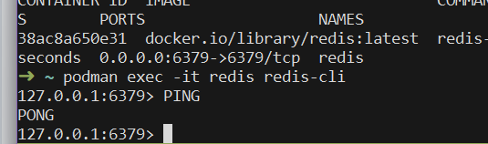
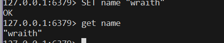
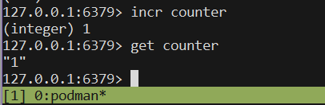

# Migration 

### Task 1

**Brownfield vs. Greenfield:** What distinguishes a Brownfield application from a Greenfield one in terms of constraints and opportunities?

A **Brownfield application** has existing code, infrastructure, data, and dependencies that must be considered. A **Greenfield application** is built from scratch with fewer legacy constraints. Greenfield offers more freedom, while Brownfield requires careful integration with existing systems.

### Task 2

**Business Drivers:** How do business drivers such as cost reduction, agility, and compliance influence migration decisions?

Business drivers determine whether migration provides enough value to justify its cost and risk. Cost reduction can lower operational expenses, while agility enables faster delivery. Compliance requirements may also require modernization to meet regulations.

### Task 3

**Application Portfolio Assessment:** What is the purpose of conducting an application portfolio assessment before migration?

It helps organizations decide which applications should be migrated, modernized, replaced, or retired. It evaluates business value, technical health, dependencies, cost, and risk. This enables better migration decisions and prioritization.

### Task 4

**Discovery & Mapping:** Why is mapping integration points critical when planning migration?

Mapping integration points reveals how applications communicate with databases, APIs, services, and other systems. It helps identify dependencies that must be maintained during migration. Missing an important integration can cause outages or failures.

### Task 5

**Technical Debt & Stack Evaluation:** How does technical debt impact modernization strategy selection?

High technical debt makes applications harder and more expensive to maintain or migrate. It may indicate that refactoring or rebuilding is better than simply rehosting. The technology stack also determines compatibility with modern platforms and cloud services.

### Task 6

**Database & Infrastructure:** What are the main risks in database migration, and how can they be mitigated?

Database migration risks include data loss, corruption, downtime, compatibility issues, and performance problems. These can be reduced through backups, testing, data validation, and phased migration. Infrastructure dependencies should also be identified beforehand.

### Task 7

**Security & Compliance:** Why must security and compliance be reassessed during migration, even if the application was previously compliant?

Migration can introduce new security risks through changes in infrastructure, networks, access controls, and data handling. Existing compliance controls may not apply directly to the new environment. Therefore, security configurations and compliance requirements must be reassessed.

### Task 8

**Migration Strategies (6 R’s):** How do the 6 R’s of migration provide a framework for decision-making?

The 6 R’s—**Rehost, Replatform, Refactor, Repurchase, Retire, and Retain**—provide different approaches for moving applications. They help organizations choose a strategy based on business value, cost, complexity, and technical condition. This creates a structured approach to migration decisions.

### Task 9

**Cost & Effort Analysis:** How does TCO (Total Cost of Ownership) differ from upfront migration cost?

**Upfront migration cost** covers expenses required to perform the migration, such as development and infrastructure changes. **TCO** considers the total cost over time, including operations, maintenance, licensing, infrastructure, and support. TCO therefore gives a better view of long-term costs.

### Task 10

**Prioritization & Planning:** What factors determine wave planning for application migration?

Wave planning considers business importance, technical complexity, dependencies, risk, and migration readiness. Applications with manageable dependencies and high business value may be migrated earlier. Grouping applications into waves helps control risk and resources.

### Task 11

**Target-State Architecture & Patterns:** How does defining a target-state architecture guide modernization choices?

Target-state architecture defines what the modernized system should look like after migration. It guides decisions about cloud services, databases, integration, security, and deployment models. This prevents simply reproducing outdated architecture in a new environment.

### Task 12

**Containerization & Cloud-Readiness:** What are the key indicators that an application is cloud-ready?

A cloud-ready application should be portable, scalable, configurable, and have minimal dependency on specific infrastructure. It should support externalized configuration and automated deployment. Containerization helps package the application and its dependencies consistently across environments.

### Task 13

**Success Metrics & Roadmap:** Why are KPIs critical in measuring migration success?

KPIs provide measurable evidence that migration is achieving its intended goals. Metrics can include cost savings, availability, performance, deployment speed, and security improvements. They help identify problems and demonstrate business value to stakeholders.

### Task 14

**Tools & Documentation:** What role do assessment tools play in reducing subjectivity during migration planning?

Assessment tools can analyze applications, dependencies, infrastructure, and technical characteristics automatically. This reduces reliance on subjective manual evaluation and provides consistent data for comparison. Documenting the findings also provides a clear basis for migration decisions.

# Redis

### Task 1
Redis is an in-memory data store commonly used as a cache, database, or message broker.

What is Redis used for?
Caching: Store frequently accessed data in memory so it can be retrieved very quickly.
Sessions: Store user login/session information.
Real-time data: Useful for counters, leaderboards, notifications, etc.:w

Message queues / Pub-Sub: Allows applications to communicate asynchronously.

PING:

Set get :

Counter 

Here we can see the key `expvalue` has the ttl of `10 seconds`;
and when the time is past that we can see that when used `get` to returns a `(nil)` value 

