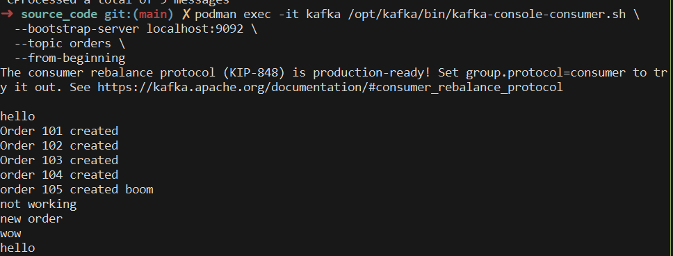
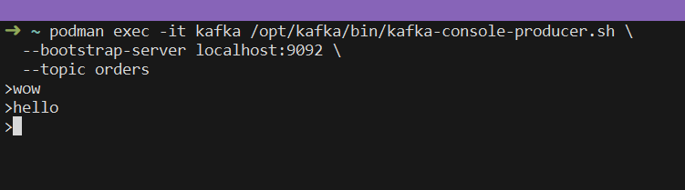
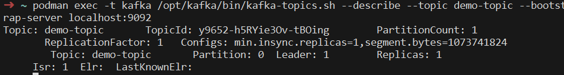

### Task 1: Deployment Strategies

**1. Overview of Deployment Strategies**
Deployment strategies balance **fast releases** with **system stability** by gradually introducing changes and providing ways to detect and recover from failures. This trade-off is critical because CI/CD aims for frequent delivery without sacrificing reliability or user experience.

**2. Blue-Green Deployment**
Blue-green deployment maintains two environments, allowing traffic to switch from the old version to the new one with **minimal downtime**. The main risk is **database schema incompatibility**, especially when the new and old application versions require different schemas.

**3. Canary Releases**
Canary releases send changes to a **small percentage of users first**, limiting the impact if something goes wrong. Traffic segmentation makes feedback more reliable because the new version can be compared against the stable version using real production behavior.

**4. Dark Launching & Shadow Traffic**
Shadow traffic sends copies of real user requests to the new system **without affecting the actual response**. This helps test performance and behavior under realistic load. Ethical concerns include **privacy, consent, and protecting sensitive user data** when replicating real traffic.

**5. Feature Flags, Rollback & Monitoring**
Feature flags allow teams to **enable or disable features instantly** without redeploying the application. Monitoring detects failures or performance issues, while automated rollback can quickly restore the stable version, reducing the impact of incidents.

### Task 2

To install kafka 

### Task 3

### Task 4

### Task 5: To increae partition size

