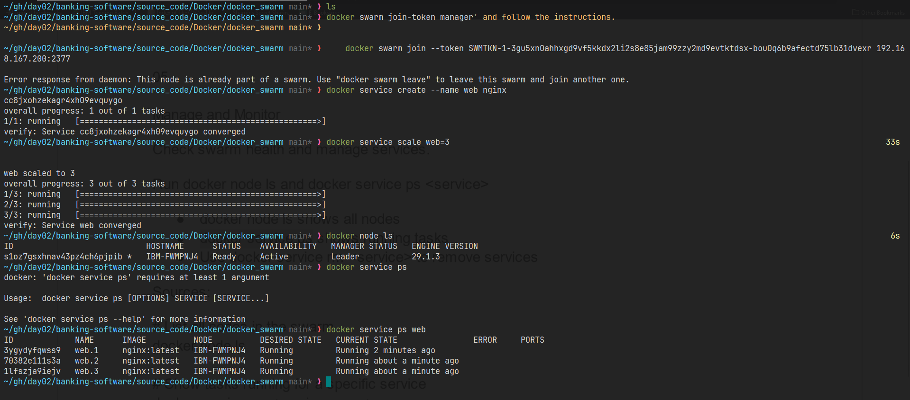

<!--toc:start-->
- [Why Swarm is Useful](#why-swarm-is-useful)
<!--toc:end-->

### Why Swarm is Useful
Cluster management → Combine multiple machines into one swarm cluster.
Service deployment → Run containers as services that can be scaled and updated easily.

Load balancing → Traffic is automatically distributed across replicas.
High availability → If one node fails, tasks are rescheduled on healthy nodes.
Rolling updates → Update services without downtime.
Networking → Overlay networks allow containers on different nodes to communicate securely.

